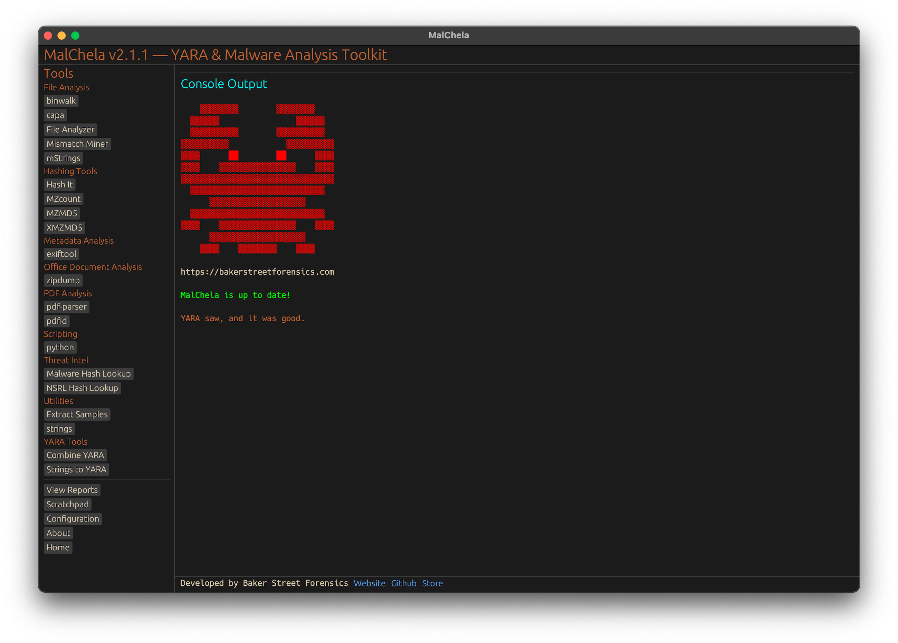
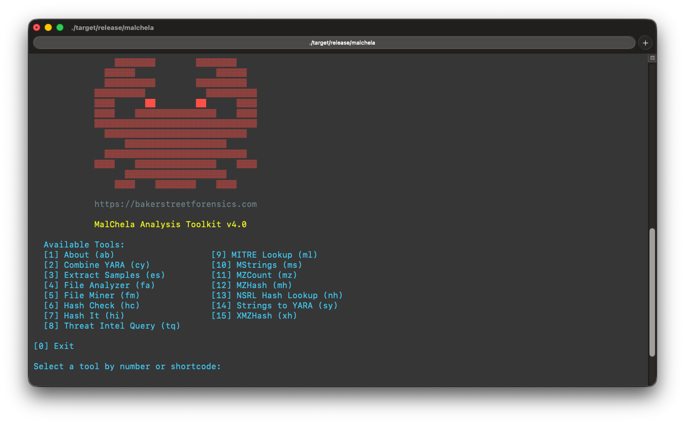

<div align="center">
 
 <p>
 <h1>
  Malchela v3.0.3
 </h1>
  <h4>
      A YARA & Malware Analysis Toolkit written in Rust.
   </h4>
<p>
<p>
 </div>
<div align="center">
  <table>
    <tr>
      <td></td>
      <td></td>
    </tr>
    <tr>
      <td align="center"><strong>GUI View</strong></td>
      <td align="center"><strong>CLI View</strong></td>
    </tr>
  </table>
</div>
  <h3>
   Features:
  </h3>

| Program             | Function |
|---------------------|----------|
| Combine YARA        | Combines all `.yara`/`.yar` files in a directory into a single rule file |
| Extract Samples     | Recursively extracts password-protected malware archives (ZIP/RAR) using common passwords |
| File Analyzer       | Analyzes a file for hashes, entropy, PE structure, fuzzy hashes, YARA matches, NSRL lookup, and VirusTotal status |
| File Miner          | Scans a folder for file type mismatches and metadata |
| Hash It              | Generates MD5, SHA1, and SHA256 hashes for a single file |
| Hash Check          | Checks if a given hash exists in a provided hash set file |
| mStrings             | Extracts strings from a file, applies regex and Sigma rules, maps to MITRE ATT&CK, identifies IOCs, and includes built-in MITRE Technique lookup |
| mzhash              | Recursively hashes files with MZ headers using MD5 — ideal for gold build or known-bad corpus generation |
| mzcount             | Recursively counts files by format (MZ, ZIP, PDF, etc.) using header/YARA detection |
| nsrlquery           | Queries an MD5 hash against the NSRL database to determine if it’s known-good |
| strings_to_yara     | Prompts for metadata and a string list to generate a YARA rule |
| xmzhash             | Recursively hashes files that are *not* MZ, ZIP, or PDF — ideal for  non-Windows malware corpus |

**The Malware Hash Lookup requires an api key for Virus Total and Malware Bazaar.  If unidentified , MalChela will prompt you to create them the first time you run the malware lookup function.*


<h3>
   About:
   </h3>

> **mal** — malware</p>
> **chela** — “crab hand”</p>
> A chela on a crab is the scientific term for a claw or pincer. It’s a specialized appendage, typically found on the first pair of legs, used for grasping, defense, and manipulating things;  just like these programs.

<h3>
Dependencies:
</h3>

```
sudo apt install openssl libssl-dev clang yara libyara-dev pkg-config build-essential libglib2.0-dev libgtk-3-dev
```

<h3>
Installation & Usage:
</h3>

Install Rust - https://rustup.rs/</p>

For CLI only installations (WSL, Raspberry Pi, etc.): 

```
 curl --proto '=https' --tlsv1.2 -sSf https://sh.rustup.rs | sh
```
Clone the repository and build 
```
git clone https://github.com/dwmetz/MalChela.git
cd MalChela
chmod +x release.sh
./release.sh  # Builds all programs in release mode (recommended)
```

<h3>
Run:
</h3>

```
./target/release/malchela
```

or 

```
./target/release/MalChelaGUI

```

ℹ️ It is recommended to build and run MalChela in `--release` mode to ensure GUI and subtools function optimally.

### Case Management (v3.0)

MalChela v3.0 introduces a full-featured case system:

- Track files, tools run, and notes under a unified `case.yaml`
- Auto-save tool output under `saved_output/cases/<case-name>/`
- Integrated tagging, search, and scratchpad with VS Code support
- Seamless case loading and archiving in GUI mode

<h3>🔧 Adding Custom Tools:</h3>

You can extend MalChela by editing the `tools.yaml` file to add third-party or custom tools to the GUI. This flexible configuration supports binaries, Python scripts, and Rust-based programs.

Each entry defines the tool’s name, category, execution type, how input is passed (file, folder, or hash), and any optional arguments. Here are a few sample entries:

```yaml
- name: capa
  description: "Detects capabilities in binaries via rules"
  command: ["capa"]
  input_type: "file"
  category: "File Analysis"
  exec_type: binary
  file_position: "last"
  optional_args: []

- name: strings
  description: "Extracts printable strings from binaries"
  command: ["strings"]
  input_type: "file"
  category: "Utilities"
  exec_type: binary
  file_position: "first"
  optional_args: []

- name: pdf-parser
  description: "Parses and analyzes suspicious PDF structures"
  command: ["python3"]
  input_type: "file"
  category: "PDF Analysis"
  exec_type: script
  file_position: "last"
  optional_args: ["tools/pdf-parser/pdf-parser.py"]
```

🦀 **REMnux Mode:**  
When run on a REMnux system, MalChela can load a REMnux-specific `tools.yaml` file tailored for the built-in tools available in that distro. This ensures smoother setup with minimal configuration required.


📝 **Notes:**
- Tools must be in your system `PATH` or include a full/relative path.
- `exec_type` must be one of: `cargo`, `binary`, or `script`.
- `file_position` indicates where the input is placed in the command (`first` or `last`).
- See the [MalChela User Guide](https://dwmetz.github.io/MalChela/) for detailed configuration examples and workflows.

<h3>
Enhanced Tool Support:
</h3>

MalChela includes improved integration with the following third-party tools:

- **Volatility 3**: Dynamic plugin builder, argument templating, and output directory selection.
- **TShark**: Visual reference panel and support for capturing filtered traffic with custom syntax.
- **YARA-X**: Smart rule matching with improved argument handling and REMnux-compatible default configuration.

These enhancements make working with memory images, PCAPs, and YARA rules more streamlined for forensic workflows.

#### Caveat Emptor:
Successfully tested on MacOS on Silicon, Ubuntu, and RaspberryPi. Yara version 4.2 or greater is required.Even though it's Rust (cross-platform), Windows is problematic based on different requirements for YARA64.exe. 

**As of October 2025 both MalChela CLI and GUI will operate on Windows under WSL2.**
