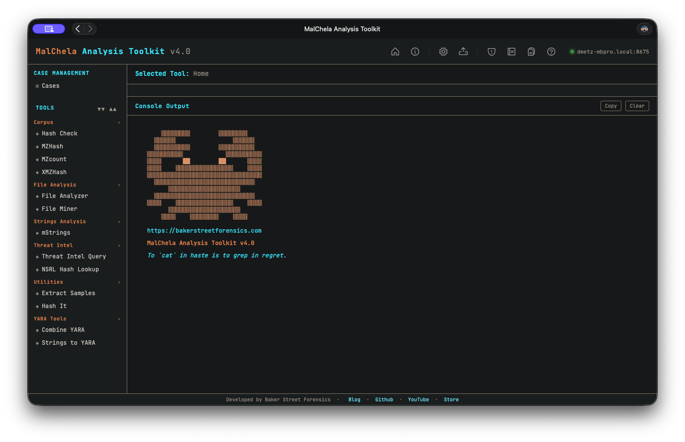

<div align="center">
 
 <p>
 <h1>
  MalChela v4.3
 </h1>
  <h4>
      A YARA &amp; Malware Analysis Toolkit written in Rust.
   </h4>
<p>

 Check out the new [MalChela instructional series](https://www.youtube.com/playlist?list=PL__KsCEzV6Ae5jA-YObTmvZEKuu-rkON6) on YouTube 
 
<p>
 </div>
<div align="center">
  <table>
    <tr>
      <td></td>
      <td></td>
    </tr>
    <tr>
      <td align="center"><strong>PWA View</strong></td>
      <td align="center"><strong>CLI View</strong></td>
    </tr>
  </table>
</div>

<h3>About:</h3>

> **mal** — malware  
> **chela** — "crab hand"  
> A chela on a crab is the scientific term for a claw or pincer. It's a specialized appendage, typically found on the first pair of legs, used for grasping, defense, and manipulating things — just like these programs.

---

<h3>Features:</h3>

| Program             | Function |
|---------------------|----------|
| Analyze             | Auto-triages a file, folder, or `.app` bundle: classifies with File Miner, dispatches every tool it suggests, and produces a combined MalChela Summary rollup report |
| Combine YARA        | Combines all `.yara`/`.yar` files in a directory into a single rule file |
| Extract Samples     | Recursively extracts password-protected malware archives (ZIP/RAR) using common passwords |
| File Analyzer       | Analyzes a file for hashes, entropy, PE structure, fuzzy hashes, YARA matches, NSRL lookup, and VirusTotal status |
| File Miner          | Scans a folder for file type mismatches and metadata |
| Hash It             | Generates MD5, SHA1, and SHA256 hashes for a single file |
| Hash Check          | Checks if a given hash exists in a provided hash set file |
| Threat Intel Query  | Multi-source hash **and URL** lookup. Hash sources: VirusTotal, MalwareBazaar, OTX, Hybrid Analysis, FileScan.IO, Malshare, MetaDefender, ObjectiveSee. URL sources: VirusTotal, urlscan.io, Google Safe Browsing. GUI adds file-to-hash and QR code decode → URL lookup. |
| mStrings            | Extracts strings from a file — including Mach-O binaries and `.app` bundles — applies regex and Sigma rules, maps to MITRE ATT&CK, identifies filesystem/network IOCs, and includes built-in MITRE Technique lookup |
| mzhash              | Recursively hashes files with MZ headers using MD5 — ideal for gold build or known-bad corpus generation |
| mzcount             | Recursively counts files by format (MZ, ZIP, PDF, etc.) using header/YARA detection |
| nsrlquery           | Queries an MD5 hash against the NSRL database to determine if it's known-good |
| strings_to_yara     | Prompts for metadata and a string list to generate a YARA rule |
| xmzhash             | Recursively hashes files that are *not* MZ, ZIP, or PDF — ideal for non-Windows malware corpus |

**Mac Analysis** *(v4.2+)*

| Program          | Function |
|------------------|----------|
| Code Sign Check  | Inspects macOS code signing: Developer-signed vs. ad-hoc vs. unsigned, Team ID, Bundle ID, entitlements, and `get-task-allow` flag |
| dpp Extract      | Unwraps a `.dmg` or `.pkg` (UDIF → HFS+/APFS → XAR → PBZX/CPIO) to reach the real payload files inside |
| Mach-O Info      | Parses Mach-O binaries: architecture, linked libraries, section entropy, symbol status, RPATH entries, and deprecated crypto library detection |
| mStrings         | Extracts strings, IOCs, and MITRE ATT&CK matches from Mach-O binaries and `.app` bundles |
| Plist Analyzer   | Parses `.plist` files and `.app` bundle `Info.plist` for malware indicators: hidden background agent, ATS disabled, custom URL schemes, env injection |

Code Sign Check, Mach-O Info, mStrings, and Plist Analyzer auto-resolve a `.app` bundle's main executable (via `CFBundleExecutable`, falling back to the sole binary in `Contents/MacOS/`) — point them at the bundle directly. Run those four together against a bundle or binary with `./mac_stack.sh`. More Mac-specific detections are planned for upcoming releases.

*Threat Intel Query supports optional API keys for VirusTotal, MalwareBazaar, OTX, and additional sources. Sources without configured keys are skipped automatically.*

---

<h3>Dependencies:</h3>

Linux
```
sudo apt install openssl libssl-dev clang yara libyara-dev libjansson-dev pkg-config build-essential libglib2.0-dev libgtk-3-dev
```

Mac
```
brew install openssl yara pkg-config gtk+3 glib
```
Note: YARA 4.2> required.
Before building, point the build to to Homebrew's YARA prefix
```
export YARA_LIBRARY_PATH=$(brew --prefix yara)/lib
export BINDGEN_EXTRA_CLANG_ARGS="-I$(brew --prefix yara)/include"
```

---

<h3>Installation &amp; Usage:</h3>

Install Rust — https://rustup.rs/

For CLI only installations (WSL, Raspberry Pi, etc.):

```
curl --proto '=https' --tlsv1.2 -sSf https://sh.rustup.rs | sh
```

Clone the repository and build:

```
git clone https://github.com/dwmetz/MalChela.git
cd MalChela
chmod +x release.sh
./release.sh  # Builds all programs in release mode (recommended)
```

If you cloned MalChela before 17-Apr-2026, you may see a diverging branches error when pulling. Run `git fetch origin && git reset --hard origin/main` to resync. This was a one-time history rewrite to remove a large file.

<h3>Run:</h3>

#### PWA (recommended):

On first run, execute the setup script after building the binaries:

```
cd server
./setup-server.sh
```

Then start the server:

```
./start-server.sh
```

The PWA will be accessible from any browser on the local network.

#### CLI:

```
./target/release/malchela
```

The CLI is retained for scripting and automation use cases.


ℹ️ It is recommended to build and run MalChela in `--release` mode to ensure GUI and subtools function optimally.

> ⚠️ **Important:** MalChela binaries must be invoked from the project root directory. Always use `cd /path/to/MalChela && ./target/release/<binary>` rather than calling the binary directly from another path. This is required for correct resolution of API key files (`vt-api.txt`, `mb-api.txt`), YARA rules, and Sigma rules — all of which are resolved relative to the project root. API keys are read exclusively from these files; environment variables are not supported.

---

### Case Management

MalChela includes a full-featured case system:

- Cases no longer require starting with a file or folder — any tool result can be saved to a case
- Create a new case from within a running tool session
- Output saved under saved_output/cases/<case-name>/
- Integrated tagging, search, and status (open/closed)
- Seamless case loading and archiving


---

### 🔍 Analyze — One-Click Auto-Triage *(v4.2)*

Point Analyze at a file, folder, or `.app` bundle and it classifies everything with File Miner, then automatically dispatches every tool File Miner suggests for each file it finds — no need to read the suggestions and run each tool by hand.

- Available in both the PWA and as an `analyze` tool in the MCP server, so AI agents can run the same triage workflow directly.
- **Save to Case** is opt-in, matching every other tool panel's checkbox-and-dropdown pattern.
- **Concise Output** (on by default) renders the rollup inline instead of the full expanded per-tool output.
- Every run produces a `malchela_summary_<timestamp>.md` rollup report, saved alongside the individual tool reports it summarizes. It leads with a Triage Summary banner: file counts (with automatic duplicate-content grouping by SHA256), flagged-malicious verdicts cross-referenced from FileAnalyzer and Threat Intel Query, malware family/tag names, MITRE ATT&CK findings by tactic, filesystem/network IOCs, and structural flags/indicators from the Mac Analysis tools.

---

### 🤖 AI Integration &amp; MCP Support

MalChela exposes its full tool suite — including Analyze and the Mac Analysis stack — to AI agents like Claude through the **Model Context Protocol (MCP)**.

See [`.claude-plugin/mcp/README.md`](.claude-plugin/mcp/README.md) for setup: installing via the Claude Code plugin marketplace, running on a remote Kali/Raspberry Pi host, and API key configuration. For agentic coding environments (OpenCode and similar), MalChela ships [`AGENTS.md`](.claude-plugin/mcp/AGENTS.md), describing available tools and usage patterns for autonomous discovery.

For a detailed walkthrough of AI-assisted analysis approaches, see the blog post: [**MalChela Meets AI: Three Paths to Smarter Malware Analysis**](https://bakerstreetforensics.com)

---

<h3>🔧 Adding Custom Tools:</h3>

You can extend MalChela by editing the `tools.yaml` file to add third-party or custom tools to the GUI. This flexible configuration supports binaries, Python scripts, and Rust-based programs.

Each entry defines the tool's name, category, execution type, how input is passed (file, folder, or hash), and any optional arguments. Here are a few sample entries:

```yaml
- name: capa
  description: "Detects capabilities in binaries via rules"
  command: ["capa"]
  input_type: "file"
  category: "File Analysis"
  exec_type: binary
  file_position: "last"
  optional_args: []

- name: strings
  description: "Extracts printable strings from binaries"
  command: ["strings"]
  input_type: "file"
  category: "Utilities"
  exec_type: binary
  file_position: "first"
  optional_args: []

- name: pdf-parser
  description: "Parses and analyzes suspicious PDF structures"
  command: ["python3"]
  input_type: "file"
  category: "PDF Analysis"
  exec_type: script
  file_position: "last"
  optional_args: ["tools/pdf-parser/pdf-parser.py"]
```
---
<h3> 🦀 **REMnux Mode:**  </h3>


When run on a REMnux system, MalChela can load a REMnux-specific `tools.yaml` file tailored for the built-in tools available in that distro. This ensures smoother setup with minimal configuration required.

📝 **Notes:**
- Tools must be in your system `PATH` or include a full/relative path.
- `exec_type` must be one of: `cargo`, `binary`, or `script`.
- `file_position` indicates where the input is placed in the command (`first` or `last`).
- See the [MalChela User Guide](https://dwmetz.github.io/MalChela/) for detailed configuration examples and workflows.

---

<h3>Enhanced Tool Support:</h3>

MalChela includes improved integration with the following third-party tools:

- **Volatility 3**: Dynamic plugin builder, argument templating, and output directory selection.
- **TShark**: Visual reference panel and support for capturing filtered traffic with custom syntax.
- **YARA-X**: Smart rule matching with improved argument handling and REMnux-compatible default configuration.

These enhancements make working with memory images, PCAPs, and YARA rules more streamlined for forensic workflows.

---

#### Platform Support:

Successfully tested on macOS (Apple Silicon), Ubuntu, and Raspberry Pi.  

YARA version 4.2 or greater is required.

**Windows:** As of October 2025, both MalChela CLI and GUI operate on Windows under WSL2. MalChelaGUI improvements for WSL included in v3.1.1.

