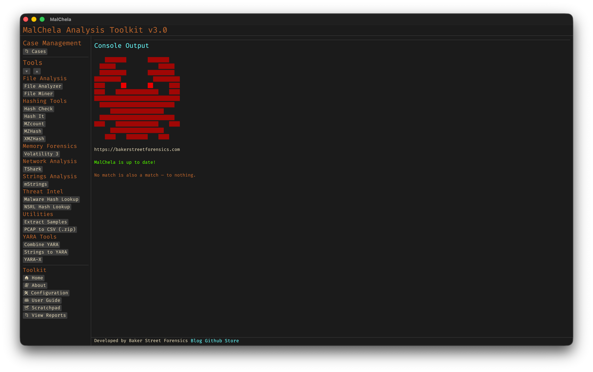

<div align="center">
 
 <p>
 <h1>
  Malchela v2.2.0
 </h1>
  <h4>
      A YARA & Malware Analysis Toolkit written in Rust.
   </h4>
<p>
<p>
 </div>
<div align="center">
  <table>
    <tr>
      <td></td>
      <td></td>
    </tr>
    <tr>
      <td align="center"><strong>GUI View</strong></td>
      <td align="center"><strong>CLI View</strong></td>
    </tr>
  </table>
</div>
  <h3>
   Features:
  </h3>

| Program  | Function |
| :-------------------  | ----------: |
| Combine YARA	| Point it at a directory of YARA files and it will output one combined rule|
| Extract Samples | Point it at a directory of password protected malware files to extract all|
| File Analyzer | Get the hash, entropy, packing, PE info, YARA and VT match status for a file |
| Hash It | Point it to a file and get the MD5, SHA1 and SHA256 hash|
| Mismatch Miner | Hunts for exes disguised as other formats|
| mStrings | Analyzes files with Sigma rules (YAML), extracts strings, matches ReGex |
| MZMD5 | Recurse a directory, for files with MZ header, create hash list|
| MZcount | Recurse a directory, uses YARA to count MZ, Zip, PDF, other| 
| NSRL Query | Query a MD5 or SHA1 hash against NSRL|
| Strings to YARA | Prompts for metadata and strings (text file) to create a YARA rule|
| Malware Hash Lookup | Query a hash value against VirusTotal & Malware Bazaar*|
| XMZMD5 | Recurse a directory, for files without MZ, Zip or PDF header, create hash list|

**The Malware Hash Lookup requires an api key for Virus Total and Malware Bazaar.  If unidentified , MalChela will prompt you to create them the first time you run the malware lookup function.*


<h3>
   About:
   </h3>

> **mal** — malware</p>
> **chela** — “crab hand”</p>
> A chela on a crab is the scientific term for a claw or pincer. It’s a specialized appendage, typically found on the first pair of legs, used for grasping, defense, and manipulating things;  just like these programs.

<h3>
Dependencies:
</h3>

```
sudo apt install openssl libssl-dev clang yara libyara-dev pkg-config build-essential libglib2.0-dev libgtk-3-dev
```

<h3>
Installation & Usage:
</h3>

Install Rust - https://rustup.rs/</p>

```
git clone https://github.com/dwmetz/MalChela.git
cd MalChela
cargo build
```

<h3>
Run:
</h3>

```
cargo run -p malchela

```
or 

```
cargo run -p MalChelaGUI

```
<h3>🔧 Adding Custom Tools:</h3>

You can extend MalChela by editing the `tools.yaml` file to add third-party or custom tools to the GUI. This flexible configuration supports binaries, Python scripts, and Rust-based programs.

Each entry defines the tool’s name, category, execution type, how input is passed (file, folder, or hash), and any optional arguments. Here are a few sample entries:

```yaml
- name: capa
  description: "Detects capabilities in binaries via rules"
  command: ["capa"]
  input_type: "file"
  category: "File Analysis"
  exec_type: binary
  file_position: "last"
  optional_args: []

- name: strings
  description: "Extracts printable strings from binaries"
  command: ["strings"]
  input_type: "file"
  category: "Utilities"
  exec_type: binary
  file_position: "first"
  optional_args: []

- name: pdf-parser
  description: "Parses and analyzes suspicious PDF structures"
  command: ["python3"]
  input_type: "file"
  category: "PDF Analysis"
  exec_type: script
  file_position: "last"
  optional_args: ["tools/pdf-parser/pdf-parser.py"]
```
For advanced tool examples (including `oledump.py` and `olevba` integration with Python), see the [MalChela User Guide](https://dwmetz.github.io/MalChela/).

🦀 **REMnux Mode:**  
When run on a REMnux system, MalChela can load a REMnux-specific `tools.yaml` file tailored for the built-in tools available in that distro. This ensures smoother setup with minimal configuration required.


📝 **Notes:**
- Tools must be in your system `PATH` or include a full/relative path.
- `exec_type` must be one of: `cargo`, `binary`, or `script`.
- `file_position` indicates where the input is placed in the command (`first` or `last`).
- See the [MalChela User Guide](https://dwmetz.github.io/MalChela/) for detailed configuration examples and workflows.

<h3>
Enhanced Tool Support:
</h3>

MalChela v2.2.0 includes improved integration with the following third-party tools:

- **Volatility 3**: Dynamic plugin builder, argument templating, and output directory selection.
- **TShark**: Visual reference panel and support for capturing filtered traffic with custom syntax.
- **YARA-X**: Smart rule matching with improved argument handling and REMnux-compatible default configuration.

These enhancements make working with memory images, PCAPs, and YARA rules more streamlined for forensic workflows.

#### Caveat Emptor:
Successfully tested on MacOS on Silicon and Ubuntu. Even though it's Rust (cross-platform), Windows is problematic based on different requirements for YARA64.exe. Works on Windows in WSL! Testers (and contributors) appreciated.
