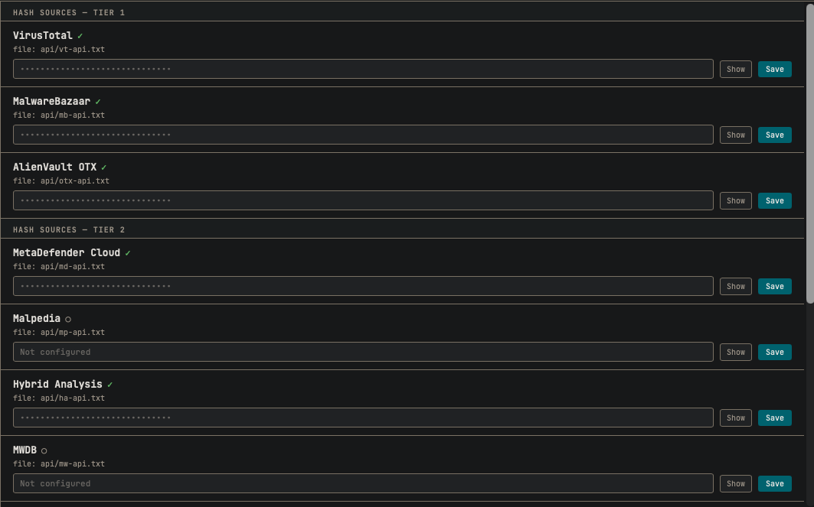

# API Configuration

Some tools within MalChela rely on external services. In order to use these integrations, you must configure your API credentials.

## Tools That Use API Keys

| Tool          | Service               | Key File          | Purpose                                       |
|---------------|-----------------------|-------------------|-----------------------------------------------|
| `fileanalyzer`| VirusTotal            | `vt-api.txt`      | Hash lookup                                   |
| `tiquery`     | VirusTotal            | `vt-api.txt`      | Hash and URL lookup (Tier 1)                  |
| `tiquery`     | MalwareBazaar         | `mb-api.txt`      | Multi-source hash lookup (Tier 1)             |
| `tiquery`     | AlienVault OTX        | `otx-api.txt`     | Multi-source hash lookup (Tier 1)             |
| `tiquery`     | MetaDefender          | `md-api.txt`      | Multi-source hash lookup (Tier 1)             |
| `tiquery`     | Hybrid Analysis       | `ha-api.txt`      | Multi-source hash lookup (Tier 2)             |
| `tiquery`     | FileScan.IO           | `fs-api.txt`      | Multi-source hash lookup (Tier 2)             |
| `tiquery`     | Malshare              | `ms-api.txt`      | Multi-source hash lookup (Tier 2)             |
| `tiquery`     | Triage                | `tr-api.txt`      | Multi-source hash lookup (Tier 2)             |
| `tiquery`     | urlscan.io            | `url-api.txt`     | URL lookup (optional — raises rate limits)    |
| `tiquery`     | Google Safe Browsing  | `gsb-api.txt`     | URL lookup                                    |

---

## Where to Configure

MalChela stores API keys as plain text files in the `api/` directory of your workspace:

```
api/vt-api.txt
api/mb-api.txt
api/otx-api.txt
api/md-api.txt
api/ha-api.txt
api/fs-api.txt
api/ms-api.txt
api/tr-api.txt
api/url-api.txt
api/gsb-api.txt
```

Each file should contain a single line with your API key. Keys are read at runtime — tools automatically skip sources whose key file is absent.

---


**Figure 4.0:** API Configuration Utility

## Managing Your Keys with the Configuration Utility

The MalChela web interface includes a built-in Configuration Panel that lets you easily **Create or update API key files** without opening a text editor.

Look for the **API Key Management** section in the Configuration Panel. Changes take effect immediately and persist across sessions.

---

## Best Practices

- **Keep these files private.** Do not commit them to Git or share them publicly.

---

> If a tool requires an API key but none is found, it will log a warning and skip external requests.
