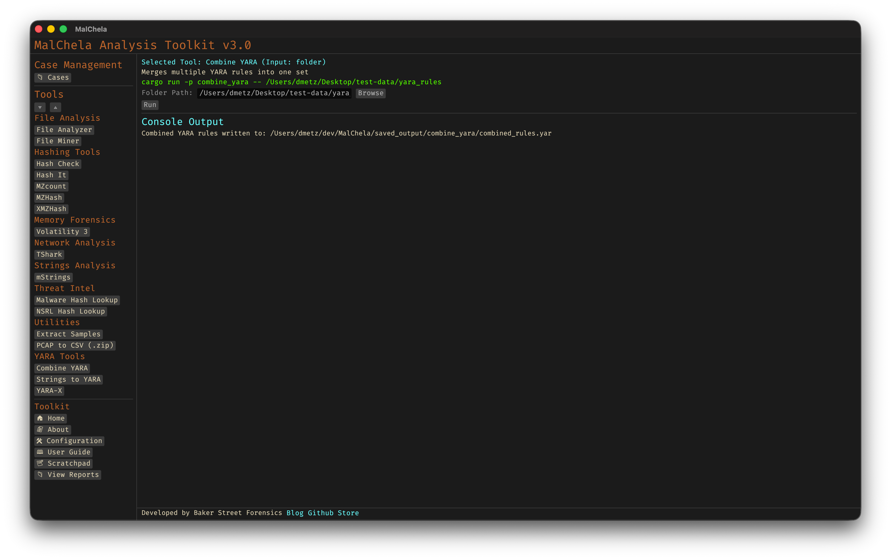

Combine YARA merges multiple YARA rule files into a single consolidated rule set. It recursively scans a folder for .yar or .yara files and combines them into one output file. Ideal for organizing or deploying rule collections.



<p align="center"><strong>Figure 7:</strong> Combine YARA</p>


---

### 🔧 CLI Syntax

```bash
cargo run -p combine_yara /path_to_yara_rules/
```

If no path is provided, the tool will prompt you to enter the directory interactively.

```bash
Enter the directory path to scan for YARA rules:
```