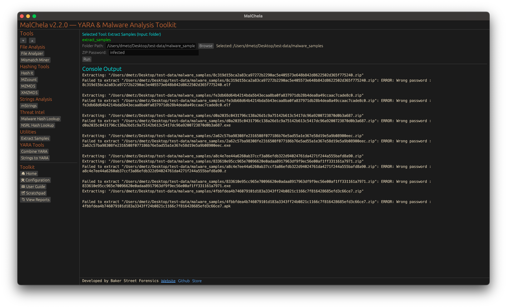

Extract Samples recursively unpacks password-protected archives commonly used in malware sharing (e.g., .zip, .rar, .7z). It uses default malware research passwords like infected and malware to extract samples in bulk for analysis.



<p align="center"><strong>Figure 12:</strong> Extract Samples</p>

---

### 🔧 CLI Syntax

```bash
# Example 1: No case name
cargo run -p extract_samples /path_to_directory/ infected
```

In this mode, extracted files will be placed in the same location as each archive found.

```bash
# Example 2: With case name
cargo run -p extract_samples /path_to_directory/ infected --case Case123
```

When `--case` is provided, all extracted files will be saved under:

```
/saved_output/cases/Case123/extract_samples/
```

If no path or password is provided, the tool will prompt for them interactively.
