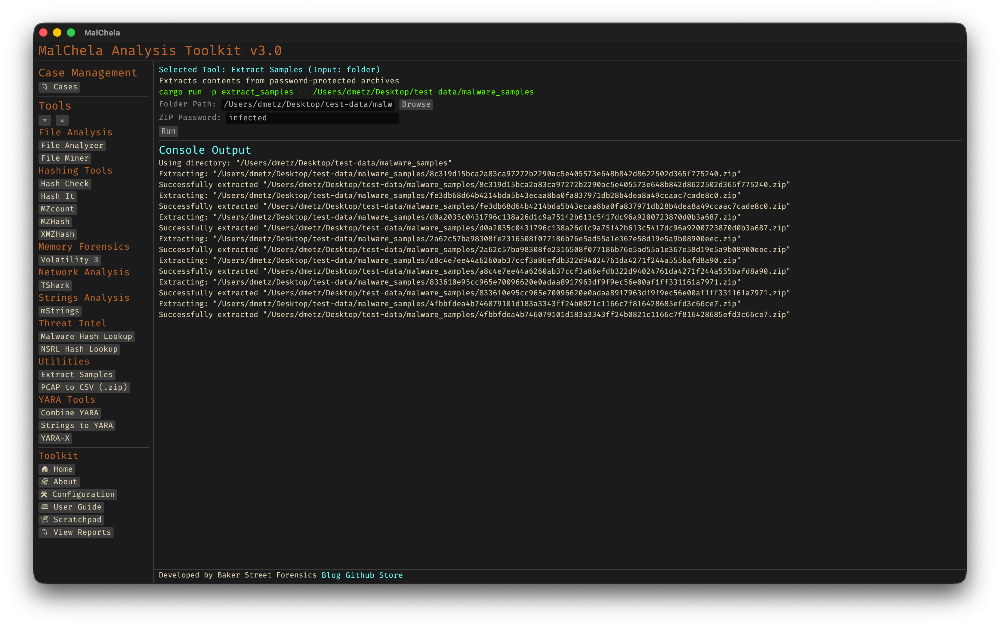

Extract Samples recursively unpacks password-protected archives commonly used in malware sharing (e.g., .zip, .rar, .7z). It uses default malware research passwords like infected and malware to extract samples in bulk for analysis.



<p align="center"><strong>Figure 8:</strong> Extract Samples</p>

---

### 🔧 CLI Syntax

```bash
cargo run -p extract_samples /path_to_directory/ infected
```

If no path or password is provided, the tool will prompt you to enter them interactively.

```bash
Enter the directory path to scan for archives:
Enter the password to use for extraction:
```
