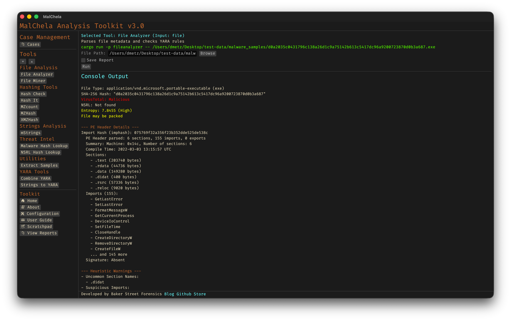

FileAnalyzer performs deep static analysis on a single file. It extracts hashes, entropy, file type metadata, YARA rule matches, NSRL validation, and — for PE files — rich header details including import/export tables, compile timestamp, and section flags. Ideal for triaging unknown executables or confirming known file traits.



<p align="center"><strong>Figure 9:</strong> File Analyzer</p>

- YARA rules for `fileanalyzer` are stored in the `yara_rules` folder in the workspace. You can modify or add rules here.

---

### 🔧 CLI Syntax

```bash
# Example 1: No case name
cargo run -p fileanalyzer -- /path_to_file/ -o -t

# Example 2: With case name
cargo run -p fileanalyzer -- /path_to_file/ -o -t --case Case123
```

When `--case` is provided, output will be saved under:

```
/saved_output/cases/Case123/fileanalyzer/
```

If `--case` is not specified, files will be saved in the default `saved_output/fileanalyzer/` folder.
