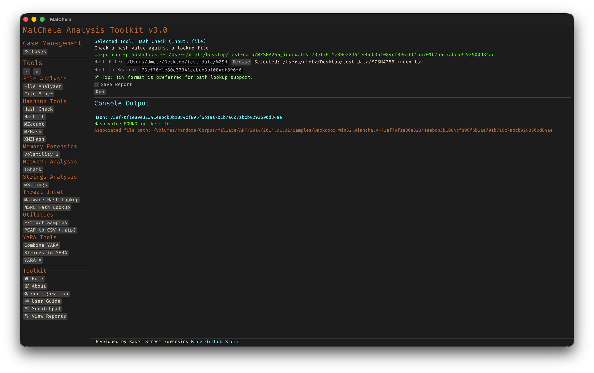

**HashCheck** lets you quickly verify whether a given set of files (or hash values) match any entry in one or more known-good or known-bad hash lists. It’s designed to help analysts triage large collections of files by comparing against reference datasets — for example, malware repositories, NSRL exports, or your own curated lists.

Hash lists should be in `.tsv` format (tab-separated values) for best compatibility, though `.txt` files are also accepted.



<p align="center"><strong>Figure 10:</strong> Hash Check</p>

You can generate .tsv lookup files using [MZHash](mzhash.md) or [XMZHash](xmzhash.md).

HashCheck supports **MD5**, **SHA1**, and **SHA256** formats.

---

### 🔧 CLI Syntax

```bash
cargo run -p hashcheck ./hashes.tsv 44d88612fea8a8f36de82e1278abb02f
```
*Searches for the hash in the provided TSV or TXT file. Prompts interactively if not supplied.*

#### Optional Output Formats

Use `-o` to save results, along with one of the following:

```bash
cargo run -p hashcheck ./hashes.tsv 44d88612fea8a8f36de82e1278abb02f -- -o -t
```
*Saves the result as a `.txt` file.*

```bash
cargo run -p hashcheck ./hashes.tsv 44d88612fea8a8f36de82e1278abb02f -- -o -j
```
*Saves the result as a `.json` file.*

```bash
cargo run -p hashcheck ./hashes.tsv 44d88612fea8a8f36de82e1278abb02f -- -o -m
```
*Saves the result as a `.md` (Markdown) file.*