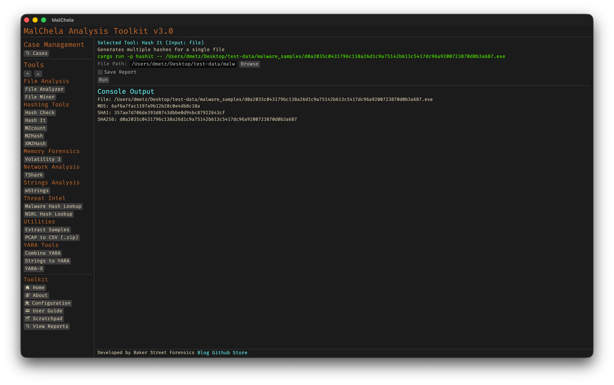

`hashit` is a flexible hashing utility that supports calculating multiple hash types for one or more files. It can be used to verify file integrity, generate forensic reports, or build hash sets for analysis. Output can be saved in text, JSON, or Markdown format, and optionally redirected into a case folder.



<p align="center"><strong>Figure 17:</strong> Hash It</p>

The tool supports batch operations on directories and automatically recurses through subfolders. It's especially useful during triage to generate hash inventories or validate file integrity against known datasets.

### 🔧 CLI Syntax

```bash
# Example 1: Show hash values only
cargo run -p hashit -- /path_to_file/

# Example 2: Save as .txt
cargo run -p hashit -- /path_to_file/ -o -t

# Example 3: Save to case folder
cargo run -p hashit -- /path_to_file/ -o -t --case CaseName
```

Use `-o` to save output and include one of the following format flags:
- `-t` → Save as `.txt`
- `-j` → Save as `.json`
- `-m` → Save as `.md`

If no file is provided, the tool will prompt you to enter the path interactively.

When `--case` is used, output will be saved under:

```
saved_output/cases/CaseName/hashit/
```

Otherwise, reports are saved to:

```
saved_output/hashit/
```