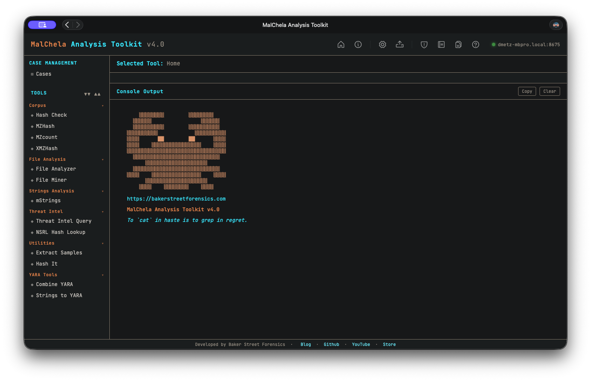
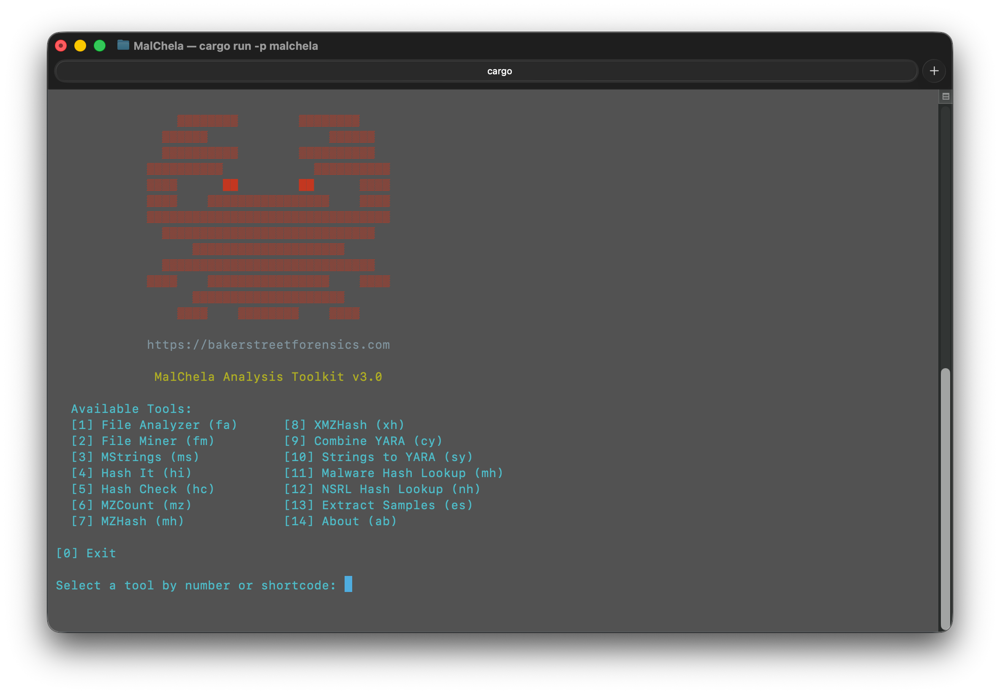

<strong>Figure 9:</strong> MalChela GUI

<strong>Figure 10:</strong> MalChela CLI

<h2 style="text-align: center;">MalChela Core Tools</h2>

  These built-in programs provide fast, flexible functionality for forensics and malware triage.

<table style="margin-left: 8%; width: 100%;">
  <thead>
    <tr>
      <th>Program</th>
      <th>Function</th>
    </tr>
  </thead>
  <tbody>
    <tr><td>Combine YARA</td><td>Point it at a directory of YARA files and it will output one combined rule</td></tr>
    <tr><td>Extract Samples</td><td>Point it at a directory of password protected malware files to extract all</td></tr>
    <tr><td>File Analyzer</td><td>Get the hash, entropy, packing, PE info, YARA and VT match status for a file</td></tr>
    <tr><td>File Miner</td><td>Scans a folder for file type mismatches and metadata, and provides suggested tools</td></tr>
    <tr><td>Hash Check</td><td>Check a hash against a .txt or .tsv lookup table</td></tr>
    <tr><td>Hash It</td><td>Point it to a file and get the MD5, SHA1 and SHA256 hash</td></tr>
    <tr><td>mStrings</td><td>Analyzes files with Sigma rules (YAML), extracts strings, matches ReGex</td></tr>
    <tr><td>MZHash</td><td>Recurse a directory, for files with MZ header, create hash list and lookup table</td></tr>
    <tr><td>MZcount</td><td>Recurse a directory, uses YARA to count MZ, Zip, PDF, other</td></tr>
    <tr><td>NSRL Query</td><td>Query a MD5 or SHA1 hash against NSRL</td></tr>
    <tr><td>Strings to YARA</td><td>Prompts for metadata and strings (text file) to create a YARA rule</td></tr>
    <tr><td>Malware Hash Lookup</td><td>Query a hash value against VirusTotal & Malware Bazaar*</td></tr>
    <tr><td>XMZHash</td><td>Recurse a directory, for files without MZ, Zip or PDF header, create hash list and lookup table</td></tr>
  </tbody>
</table>

  <strong>*The Malware Hash Lookup requires an API key for VirusTotal and Malware Bazaar.</strong> If unidentified, MalChela will prompt you to create them the first time you run the malware lookup function.

