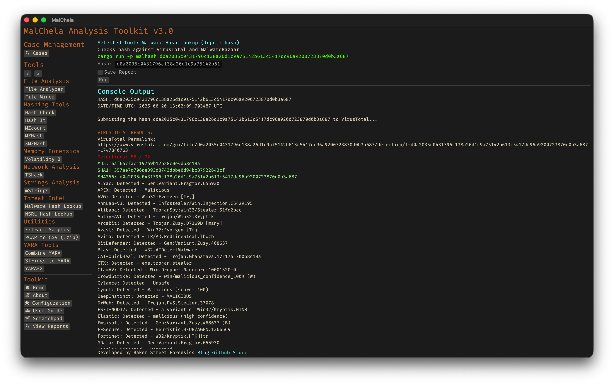

MalHash queries malware intelligence sources using a provided hash. It checks VirusTotal and MalwareBazaar for file metadata, threat labels, antivirus detections, and known associations. A quick way to enrich an unknown sample or confirm if a hash is already known and classified in the wild.



<p align="center"><strong>Figure 12:</strong> Malware Hash Lookup</p>

The first time you run MalHash, you’ll be prompted to [configure API keys](../configuration/api-configuration.md) for VirusTotal and MalwareBazaar if they’re not already set.

---

### 🔧 CLI Syntax

```bash
cargo run -p malhash -- d41d8cd98f00b204e9800998ecf8427e
```

Displays enrichment results in the terminal for the provided hash.

```bash
cargo run -p malhash -- d41d8cd98f00b204e9800998ecf8427e -o -t
```

Saves the results as a `.txt` file.

Use `-o` to save output and include one of the following format flags:
- `-t` → Save as `.txt`
- `-j` → Save as `.json`
- `-m` → Save as `.md`

If no hash is provided, the tool will prompt you to enter it interactively.

```bash
Enter the malware hash value:
```

