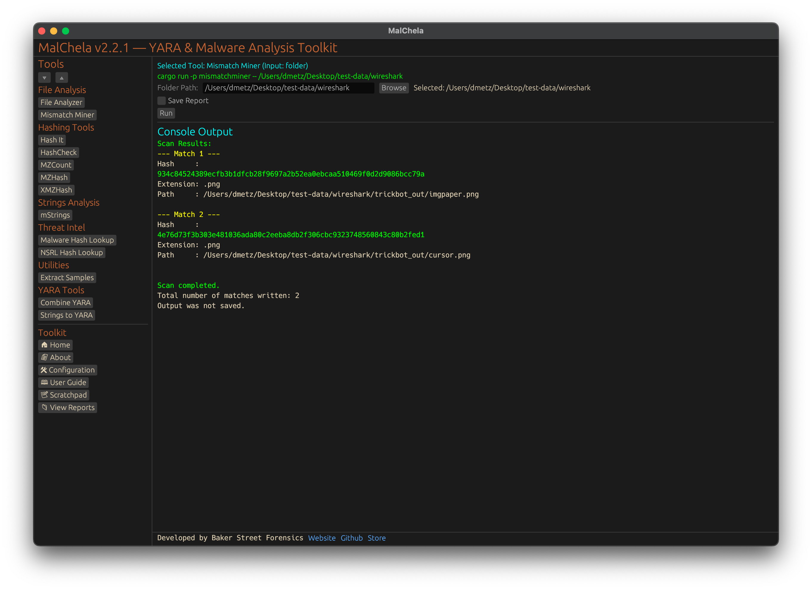

MismatchMiner scans directories for files whose extension does not match their internal file signature. It flags suspicious files like executables masquerading as documents or images, helping analysts quickly identify potentially malicious or obfuscated payloads.



<p align="center"><strong>Figure 13:</strong> Mismatch Miner</p>


---

### 🔧 CLI Syntax

```bash
cargo run -p mismatchminer -- /path_to_scan/
```

Scans the given directory and displays results in the terminal.

```bash
cargo run -p mismatchminer -- /path_to_scan/ -o -t
```

Saves the results as a `.txt` file.

Use `-o` to save output and include one of the following format flags:
- `-t` → Save as `.txt`
- `-j` → Save as `.json`
- `-m` → Save as `.md`

If no path is provided, the tool will prompt you to enter it interactively.

```bash
Enter the path to the directory to scan:
```
