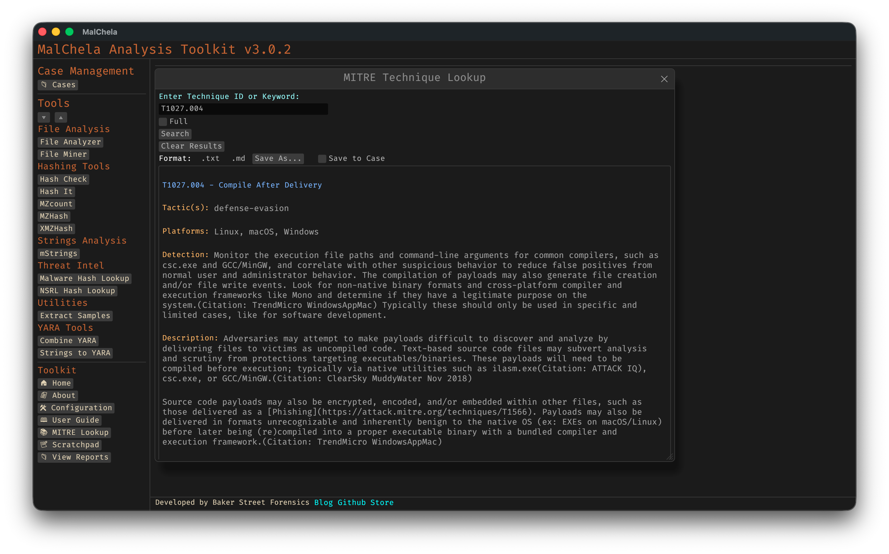

The MITRE Reference Panel provides a built-in way to explore MITRE ATT&CK techniques directly within MalChela.

This panel supports live search by **technique ID** (e.g., `T1059`) or **keyword** (e.g., "scripting"). It is context-aware and optimized for use alongside tools like `mstrings`.

# MITRE Lookup Panel

## Features

- Full display of technique details:
  - **Technique title**
  - **Tactic(s)**
  - **Platforms**
  - **Description**
  - **Detection guidance**
  - **Malware**
  - **Tools**
  - **Intrusion Sets**


- Modal view floats above the main console, allowing uninterrupted output viewing
- --full option to support long-form content (no truncation)
- Save lookups for later reference or save to a Case
- Markdown formatting for MITRE reports for inclusion in forensics reports

## Accessing from the MalChela GUI:

- Select **MITRE Lookup** in the left-hand **Toolbox** menu
- Use the input field at the top of the modal to enter a keyword or technique ID (e.g., `T1059` or `registry`)
- Use the "Full" checkbox for un-truncated output



<p align="center"><strong>Figure 5.11.1:</strong> MITRE Lookup</p>

## Accessing from CLI

There are two ways to use the MITRE Lookup from the command line:

### 1. From the main MalChela CLI menu

Run the MalChela CLI interface and select `MITRE Lookup` from the Toolbox section:

```bash
cargo run -p malchela
```

Then choose `MITRE Lookup` (or press `ml`) from the menu.

### 2. Direct tool execution

You can run the MITRE Lookup tool directly with a search term or flags:

```bash
# Basic search by keyword or technique ID
./target/release/MITRE_lookup -- t1027.004

# Use --full to display untruncated results
./target/release/MITRE_lookup --full -- t1027.004
```


<p align="center"><strong>Figure 5.11.2:</strong> MITRE Lookup (CLI)</p>

## Example

Searching for `T1027.004` yields:

```
🔹 T1027.004 - Compile After Delivery  
Tactic(s): defense-evasion  
Platforms: Windows, Linux, macOS  
Detection: Monitor execution of common compilers and correlate with file creation events.  
Description: Adversaries may compile code after transferring it to a victim system.
```
