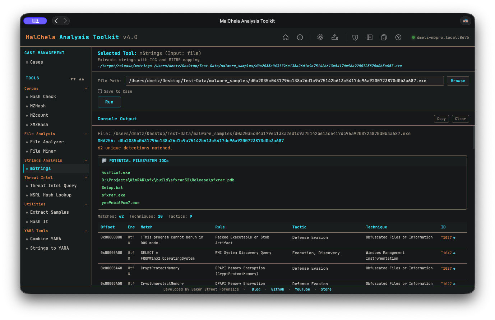

mStrings extracts strings from files and classifies them using regular expressions, YARA rules, and MITRE ATT&CK mappings. It highlights potential indicators of compromise and suspicious behavior, grouping matches by tactic and technique. Ideal for quickly surfacing malicious capabilities in binaries, scripts, and documents.

Note: The MITRE Technique Lookup bar, introduced in v3.0.1 has been removed. It has been replaced with a full [MITRE lookup utility](mitre_lookup.md) (no internet required.)



<p align="center"><strong>Figure 5.10:</strong> MStrings</p>

---

### 🔧 CLI Syntax

```bash
# Example 1: Scan a file
cargo run -p mstrings -- /path_to_file/

# Example 2: Save output as .txt
cargo run -p mstrings -- /path_to_file/ -o -t

# Example 3: Save output to a case folder
cargo run -p mstrings -- /path_to_file/ -o -t --case CaseXYZ
```

Use `-o` to save output and include one of the following format flags:
- `-t` → Save as `.txt`
- `-j` → Save as `.json`
- `-m` → Save as `.md`

If no file is provided, the tool will prompt you to enter the path interactively.

When `--case` is used, output is saved to:

```
saved_output/cases/CaseXYZ/mstrings/
```

Otherwise, results are saved to:

```
saved_output/mstrings/
```

> The MITRE Lookup feature is only available in the GUI version of mStrings.
