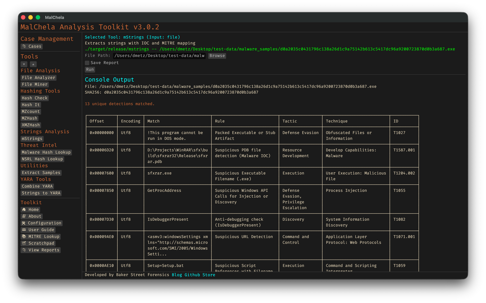

mStrings extracts strings from files and classifies them using regular expressions, YARA rules, and MITRE ATT&CK mappings. It highlights potential indicators of compromise and suspicious behavior, grouping matches by tactic and technique. Ideal for quickly surfacing malicious capabilities in binaries, scripts, and documents.

<strong>Figure 13:</strong> MStrings
