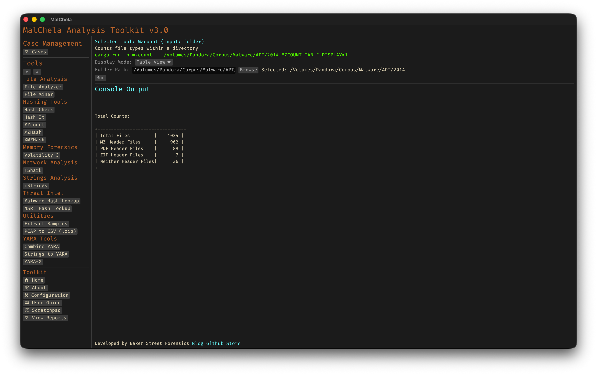

MZcount recursively scans a directory and counts the number of files that match key signatures like MZ (Windows executables), ZIP, PDF, and others. It uses lightweight YARA rules to classify files by type, giving a quick overview of the content breakdown within a dataset. Results can be displayed in either a detailed per-file view or a clean summary table, depending on your analysis needs.



<p align="center"><strong>Figure 15:</strong> MZCount Table View</p>


<p align="center"><strong>Figure 16:</strong> MZCount Detail View</p>


---

### 🔧 CLI Syntax

```bash
cargo run -p mzcount -- /path_to_scan/
```

Scans the specified directory and prints results in the terminal.

To enable table mode:

```bash
MZCOUNT_TABLE_DISPLAY=1 cargo run -p mzcount -- /path_to_scan/
```

Use this to display a live-updating summary of file types.

If no path is provided, the tool will prompt you to enter it interactively. When run from the command line with a path, it defaults to detailed output with a table summary at the end.
