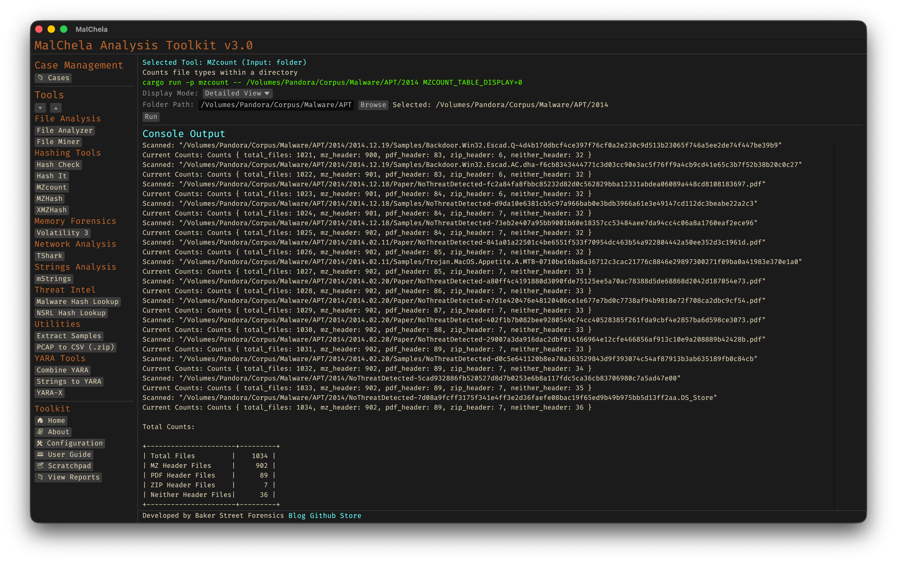

MZcount recursively scans a directory and counts the number of files that match key signatures like MZ (Windows executables), ZIP, PDF, and others. It uses lightweight YARA rules to classify files by type, giving a quick overview of the content breakdown within a dataset. Results can be displayed in either a detailed per-file view or a clean summary table, depending on your analysis needs.

<strong>Figure 14:</strong> MZCount Table View

<strong>Figure 15:</strong> MZCount Detail View
