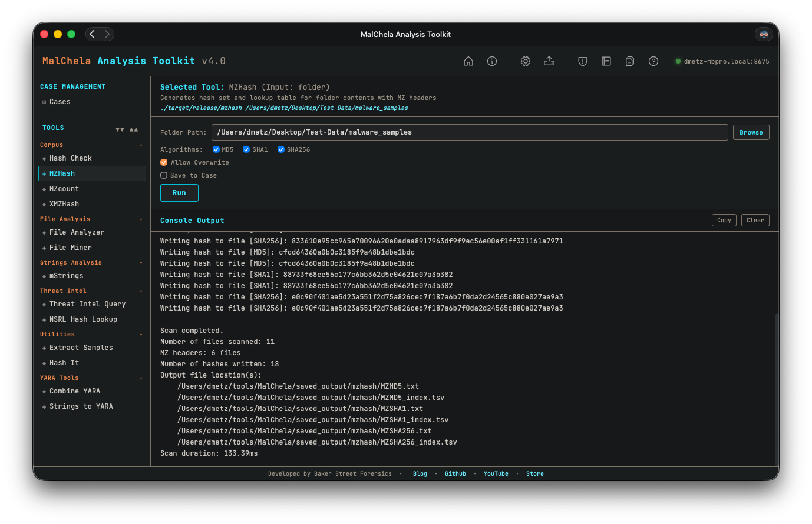

**Note:** `MZHash` replaces the deprecated `MZMd5`.

`MZHash` recursively scans a folder and generates hashes for all files that begin with the MZ header — the signature of Windows PE executables. It’s useful for building known-good or known-bad hash sets during triage, reverse engineering, or threat hunting.

You can select one or more hash algorithms at runtime: **MD5**, **SHA1**, or **SHA256**. If multiple algorithms are selected, a hash file and TSV lookup table will be generated for each.

The program outputs:
- A text file with one hash per line.
- A TSV (tab-separated values) file with full file paths and their corresponding hashes.

By default, hashes are saved to `saved_output/mzhash/`. If the file already exists, the user will be prompted before overwriting.

These hash sets (.tsv preferred) can be used with [HashCheck](hashcheck.md).



<p align="center"><strong>Figure 17:</strong> MZHash</p>

---

### 🔧 CLI Syntax

```bash
cargo run -p mzhash /path_to_directory/
```
*Generates SHA256 hashes (default).*

```bash
cargo run -p mzhash /path_to_directory/ -- -a MD5 -a SHA1 -a SHA256
```
*Generates all three hash types.*

```bash
cargo run -p mzhash /path_to_directory/ -- -a SHA1 -a SHA256
```
*Generates SHA1 and SHA256 only.*

You can combine multiple `-a` flags in any order.