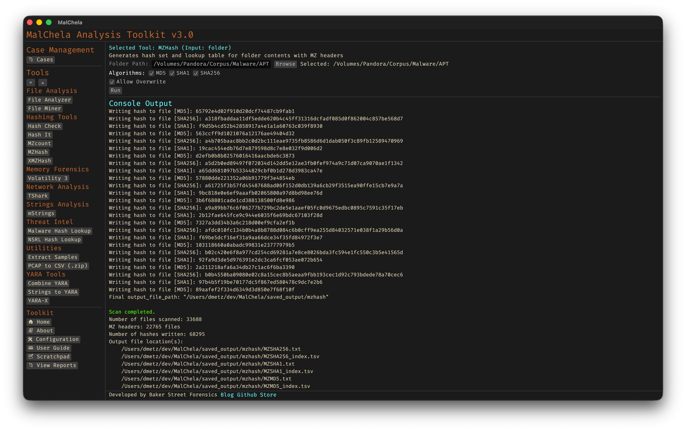

**Note:** `MZHash` replaces the deprecated `MZMd5`.

`MZHash` recursively scans a folder and generates hashes for all files that begin with the MZ header — the signature of Windows PE executables. It’s useful for building known-good or known-bad hash sets during triage, reverse engineering, or threat hunting.

You can select one or more hash algorithms at runtime: **MD5**, **SHA1**, or **SHA256**. If multiple algorithms are selected, a hash file and TSV lookup table will be generated for each.

The program outputs:
- A text file with one hash per line.
- A TSV (tab-separated values) file with full file paths and their corresponding hashes.

By default, hashes are saved to `saved_output/mzhash/`. If the file already exists, the user will be prompted before overwriting.

These hash sets (.tsv preferred) can be used with [HashCheck](hashcheck.md).



<p align="center"><strong>Figure 5.13:</strong> MZHash</p>

---

### 🔧 CLI Syntax

```bash
# Example 1: Generate default SHA256 hashes
cargo run -p mzhash -- /path_to_directory/

# Example 2: Generate all three hash types (MD5, SHA1, SHA256)
cargo run -p mzhash -- /path_to_directory/ -a MD5 -a SHA1 -a SHA256

# Example 3: Generate SHA1 and SHA256 only
cargo run -p mzhash -- /path_to_directory/ -a SHA1 -a SHA256

# Example 4: Save output to a case folder
cargo run -p mzhash -- /path_to_directory/ -a SHA256 --case CaseName
```

If `--case` is specified, output will be saved to:

```
saved_output/cases/CaseName/mzhash/
```

Otherwise, hashes are saved to:

```
saved_output/mzhash/
```

You can combine multiple `-a` flags in any order.