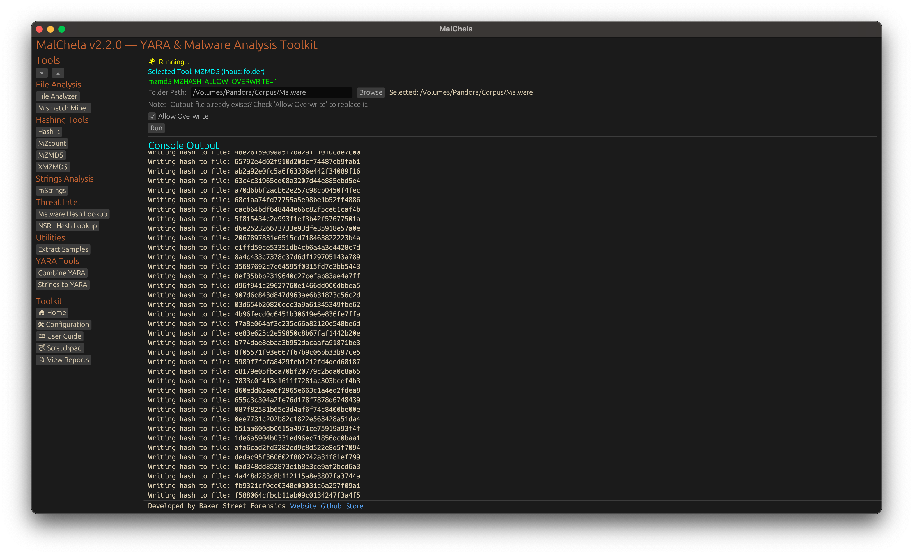

MZMD5 recursively scans a folder and generates MD5 hashes for all files that start with an MZ header — the standard signature for Windows executables. It’s useful for building hash sets of known-good or known-bad PE files during malware analysis or triage.

By default, hashes are saved to the saved_output/mzmd5/mzmd5.txt. If the file exists already you will be prompted to overwrite it.

<strong>Figure 16:</strong> MZMD5

