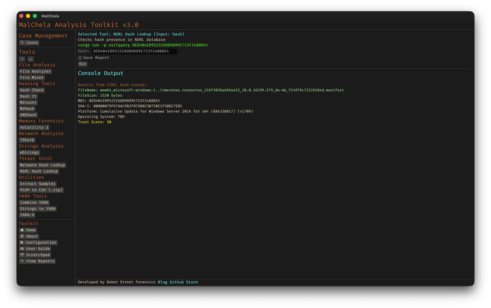

NSRL Query checks a file hash against the National Software Reference Library (NSRL) by querying the CIRCL hash lookup service. It helps identify known, trusted software — allowing analysts to filter out benign files and focus on unknown or suspicious ones during forensic triage.



<p align="center"><strong>Figure 18:</strong> NSRL Hash Lookup</p>

---

### 🔧 CLI Syntax

```bash
cargo run -p nsrlquery -- d41d8cd98f00b204e9800998ecf8427e
```

Performs a lookup using the CIRCL hashlookup API and displays the result in the terminal.

```bash
cargo run -p nsrlquery -- d41d8cd98f00b204e9800998ecf8427e -o -t
```

Saves the result as a `.txt` file.

Use `-o` to save output and include one of the following format flags:
- `-t` → Save as `.txt`
- `-j` → Save as `.json`
- `-m` → Save as `.md`

If no hash is provided, the tool will prompt you to enter it interactively.

```bash
Enter the hash value:
```

Only MD5 and SHA1 hashes are supported. If an unsupported hash length is entered:

```bash
Error: Unsupported hash length. Please enter a valid MD5 (32 chars) or SHA1 (40 chars) hash.
```

