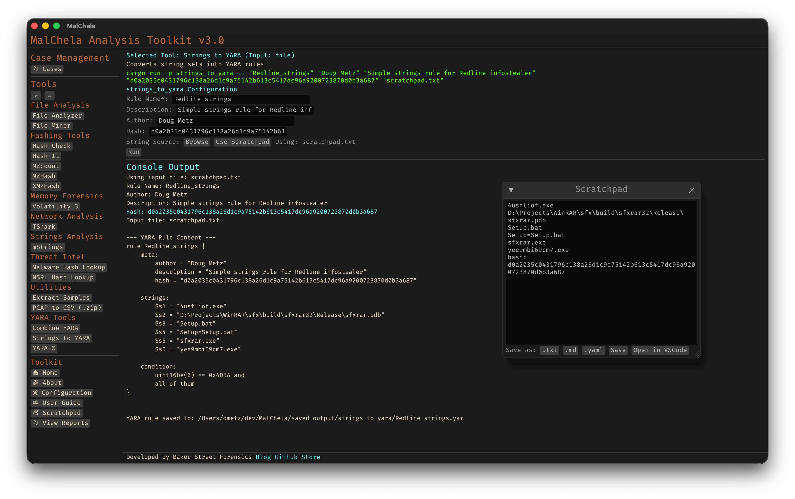

Strings to YARA helps you rapidly build custom YARA rules by prompting for a rule name, optional metadata, and a list of string indicators. It integrates with the MalChela scratchpad, allowing you to paste or collect candidate strings interactively.

Lines beginning with hash: are deliberately ignored during rule generation — this lets you use the scratchpad to track hashes alongside strings without polluting your YARA rule content.



<p align="center"><strong>Figure 5.14:</strong> Strings to YARA</p>

---

### 🔧 CLI Syntax

```bash
cargo run -p strings_to_yara -- RuleName Author Description Hash /path/to/strings.txt --case CaseName
```

You can supply up to five positional arguments. If any are omitted, the tool will prompt you interactively.

```bash
Enter rule name:
Enter author:
Enter description:
Enter hash (optional):
Enter path to string list file:
```

If the `--case` flag is supplied, the resulting YARA rule will be saved in the corresponding `saved_output/cases/CaseName/` directory.

Lines in the string file that begin with `hash:` are ignored and will not be included in the generated rule.
