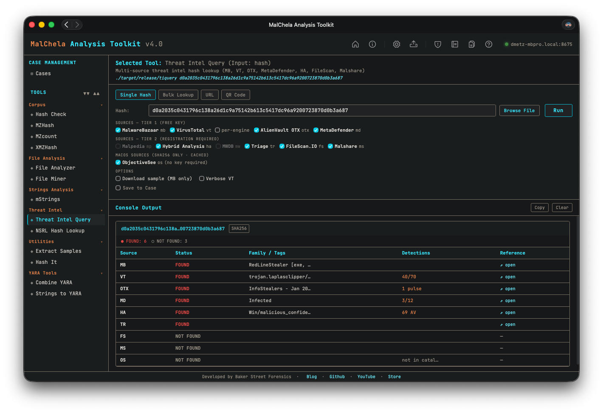
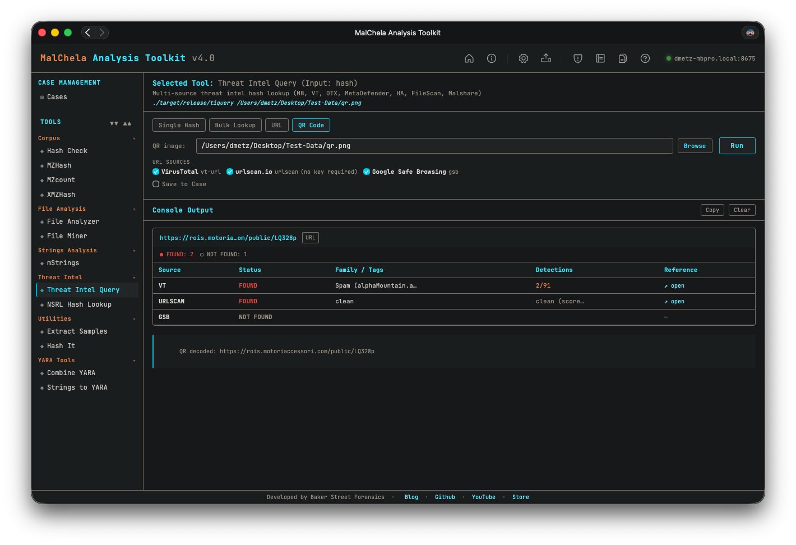

Threat Intel Query (`tiquery`) is a multi-source threat intelligence lookup tool. It queries multiple threat intelligence platforms in parallel and presents results in a unified table — giving analysts a fast, consolidated view of whether a hash or URL is known, what family/category it belongs to, and how widely it has been detected.

`tiquery` accepts a **file hash** (MD5/SHA1/SHA256), an **http/https URL**, or a **QR code image** as input and automatically routes the query to the appropriate set of sources. In the GUI, the Single Hash tab also includes a **Browse** button — pick any file and the SHA256 is computed and submitted automatically (the file itself is never uploaded, only its hash).



<p align="center"><strong>Figure 5.17:</strong> TIQuery Hash Lookup</p>



<p align="center"><strong>Figure 5.18:</strong> TIQuery QR Code Lookup</p>

---

### Supported Sources — Hash Lookups

| ID  | Source           | Tier | Key Required |
|-----|------------------|------|--------------|
| mb  | MalwareBazaar    | 1    | Optional     |
| vt  | VirusTotal       | 1    | Yes          |
| otx | AlienVault OTX   | 1    | Yes          |
| md  | MetaDefender     | 1    | Yes          |
| ha  | Hybrid Analysis  | 2    | Yes          |
| fs  | FileScan.IO      | 2    | Yes          |
| ms  | Malshare         | 2    | Yes          |
| tr  | Triage (RF)      | 2    | Yes          |
| os  | Objective-See    | 2    | No (SHA256 only) |

### Supported Sources — URL Lookups

| ID      | Source                  | Key Required |
|---------|-------------------------|--------------|
| vt      | VirusTotal (URL API)    | Yes          |
| urlscan | urlscan.io              | Optional (raises rate limits) |
| gsb     | Google Safe Browsing    | Yes          |

All sources with a configured API key are queried automatically. No flag is needed to enable Tier 2 sources — if the key file exists, the source is included. When the input is a URL, only URL-capable sources are queried. Pass `--sources` to restrict the query to specific sources.

---

### 🔧 CLI Syntax

```bash
# Hash lookup — queries all hash sources with a configured API key
tiquery <hash>

# URL lookup — queries VirusTotal (URL), urlscan.io, and Google Safe Browsing
tiquery https://example.com/path

# Restrict to specific sources
tiquery <hash> --sources mb,vt,md,ha,fs
tiquery https://example.com --sources vt,urlscan

# Include per-engine VirusTotal detections (hash mode)
tiquery <hash> --verbose-vt

# Output as JSON
tiquery <hash> --json

# Output as CSV
tiquery <hash> --csv

# Save text report
tiquery <hash> -o -t

# Save report to a case folder
tiquery <hash> -o -t --case Case123

# Download sample from MalwareBazaar (SHA256 only)
tiquery <hash> -d

# Bulk lookup — process multiple hashes from a file
tiquery --bulk hashes.txt
tiquery --bulk hashes.csv --json
tiquery --bulk hashes.txt --csv

# QR code decode + URL lookup — extract URL from a QR image and query it
tiquery --qr screenshot.png
tiquery --qr qr_image.jpg --json
```

Accepts MD5, SHA1, and SHA256 hashes, or any `http://` / `https://` URL. If no input is provided, the tool will prompt interactively.

**Bulk mode** reads a `.txt` or `.csv` file and extracts all valid MD5/SHA1/SHA256 hashes (one per line, or mixed with other content). Each hash is queried sequentially with a short delay between requests to respect API rate limits. Results are displayed as a table per hash in human mode, or as a JSON array / CSV stream when `--json` / `--csv` is specified.

**QR mode** decodes a QR code image (PNG/JPG/GIF/BMP/WebP) and uses the extracted URL as input to the standard URL lookup pipeline. Useful for triaging quishing (QR phishing) samples from emails and screenshots without needing the GUI.

---

### Output

Results are presented in a matrix showing source, status, malware family/tags, detection summary, and a reference link:

```
  tiquery <hash> (SHA256)
  ────────  ────────────  ──────────────────────  ─────────────  ────────────────────────────────────────
  Source    Status        Family / Tags           Detections     Reference
  ────────  ────────────  ──────────────────────  ─────────────  ────────────────────────────────────────
  MB        FOUND         Emotet                  ...            https://bazaar.abuse.ch/sample/...
  VT        FOUND         Trojan.Emotet           58/72          https://virustotal.com/gui/file/...
  OTX       FOUND                                 4 pulses       https://otx.alienvault.com/...
  MD        NOT FOUND                                            -
```

---

### Saving Output

Use `-o` to save output and include one of the following format flags:

- `-t` → Save as `.txt`

When `--case` is used, output is saved to:

```
saved_output/cases/Case123/tiquery/
```

Otherwise, reports are saved to:

```
saved_output/tiquery/
```

---

### API Keys

`tiquery` uses the same `api/` key file convention as other MalChela tools. Each source reads from its own file:

```
api/vt-api.txt        # VirusTotal (used for both hash and URL lookups)
api/mb-api.txt        # MalwareBazaar
api/otx-api.txt       # AlienVault OTX
api/md-api.txt        # MetaDefender
api/ha-api.txt        # Hybrid Analysis
api/fs-api.txt        # FileScan.IO
api/ms-api.txt        # Malshare
api/tr-api.txt        # Triage
api/url-api.txt       # urlscan.io (optional — raises rate limits)
api/gsb-api.txt       # Google Safe Browsing
```

Keys can be managed via the **API Keys** panel in the MalChela GUI (Configuration menu → API Keys) or by placing the key directly in the appropriate file.

See [API Configuration](https://dwmetz.github.io/MalChela/configuration/api-configuration/) for details.

---

### Bulk Lookup

Bulk lookup processes a `.txt` or `.csv` file containing hashes (one per line, or mixed with other content — the tool extracts valid MD5/SHA1/SHA256 values automatically) and runs all lookups in a single operation.

**CLI:** use the `--bulk <file>` flag (see CLI Syntax above). Results are printed as a table per hash, or as a combined JSON array / CSV when `--json` / `--csv` is specified.

**GUI:** the TIquery panel's **Bulk Lookup** tab lets you browse to a file and run all lookups in one click. Results are displayed in a consolidated grid.

---

### GUI Input Modes

The MalChela GUI's Threat Intel Query panel offers four input modes, selected via tabs at the top of the panel:

- **Single Hash** — paste a hash or click **Browse…** to pick a file; the GUI computes the file's SHA256 and populates the hash field automatically.
- **Bulk Lookup** — as described above, for batches of hashes in a file.
- **URL** — paste an `http://` or `https://` URL to query VirusTotal, urlscan.io, and Google Safe Browsing in parallel.
- **QR Code** — pick a QR code image (PNG/JPG/GIF/BMP/WebP); the GUI decodes the embedded URL and populates the URL field for review, then runs the standard URL lookup pipeline. Useful for triaging "quishing" (QR phishing) samples from emails and screenshots.

In URL and QR modes, source checkboxes auto-enable based on which API keys are configured, exactly as in hash mode.
