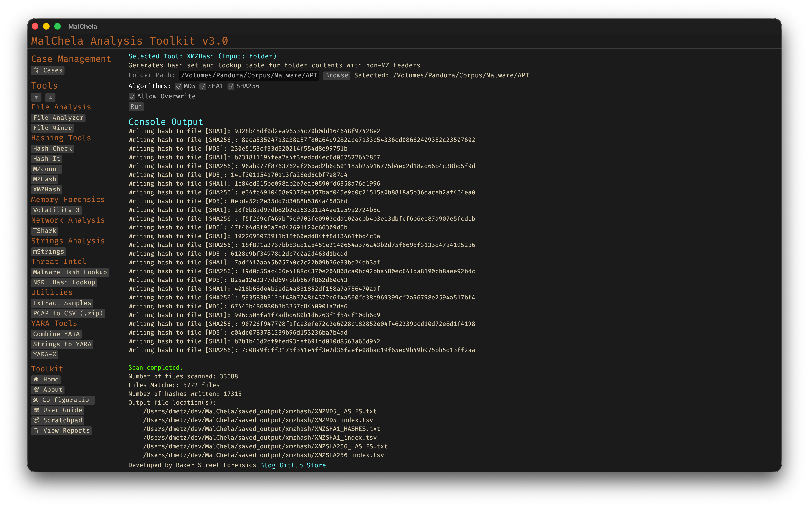

**Note:** `XMZHash` replaces the deprecated `XMZMd5`.

`XMZHash` recursively scans a directory and generates hashes for all files that **do not** match common binary or archive signatures such as MZ, ZIP, or PDF. It’s ideal for uncovering unusual or misclassified files that may require deeper inspection or reverse engineering. Use this on a malware corpus to help surface non-Windows malware samples.

You can select one or more hash algorithms at runtime: **MD5**, **SHA1**, or **SHA256**. If multiple algorithms are selected, a hash file and TSV lookup table will be generated for each.

The program outputs:
- A text file with one hash per line.
- A TSV (tab-separated values) file with full file paths and their corresponding hashes.

By default, hashes are saved to `saved_output/mzhash/`. If the file already exists, the user will be prompted before overwriting.

These hash sets (.tsv preferred) can be used with [HashCheck](hashcheck.md).



<p align="center"><strong>Figure 4.17:</strong> XMZHash</p>

---

### 🔧 CLI Syntax

```bash
cargo run -p xmzhash -- /path_to_directory/
```
*Generates SHA256 hashes (default).*

```bash
cargo run -p xmzhash -- -a MD5 -a SHA1 -a SHA256 /path_to_directory/
```
*Generates all three hash types.*

```bash
cargo run -p xmzhash -- -a SHA1 -a SHA256 /path_to_directory/
```
*Generates SHA1 and SHA256 only.*

```bash
cargo run -p xmzhash -- -a SHA256 /path_to_directory/ --case MyCase
```
*Saves results to the specified case folder.*

You can combine multiple `-a` flags in any order. If no directory is passed, you will be prompted.