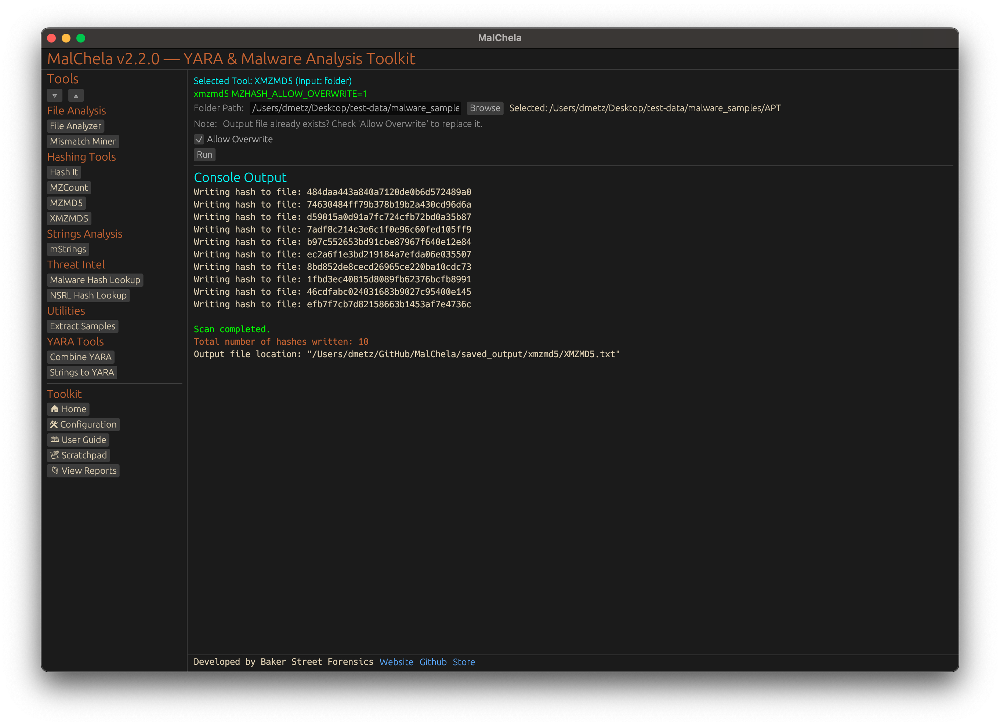

XMZMD5 recursively scans a directory and generates MD5 hashes for all files that do not match common binary or archive signatures such as MZ, ZIP, or PDF. It’s ideal for uncovering unusual or misclassified files that may require deeper inspection or reverse engineering. Use this on a malware corpus to help surface non-Windows malware samples.

<strong>Figure 19:</strong> XMZMD5
