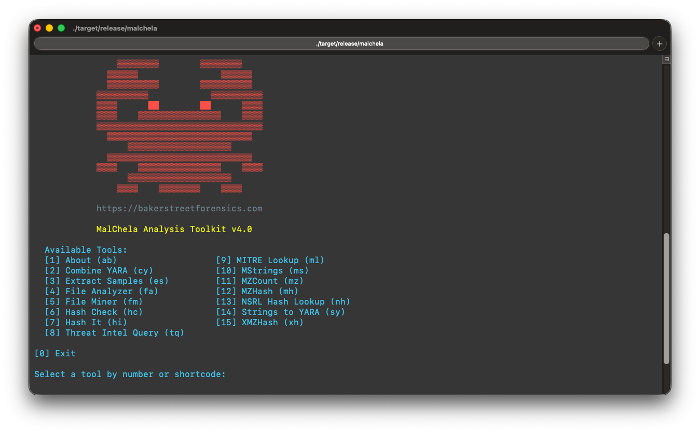

🦀 **MalChela** is a modular toolkit for digital forensic analysts, malware researchers, and threat intelligence teams. It provides both a Command Line Interface (CLI) and a browser-based web interface for running analysis tools in a unified environment.

**mal** — malware

**chela** — “crab hand”

A chela on a crab is the scientific term for a claw or pincer. It’s a specialized appendage, typically found on the first pair of legs, used for grasping, defense, and manipulating things; just like these programs.

<strong> MalChela Web Interface

<strong>MalChela CLI

