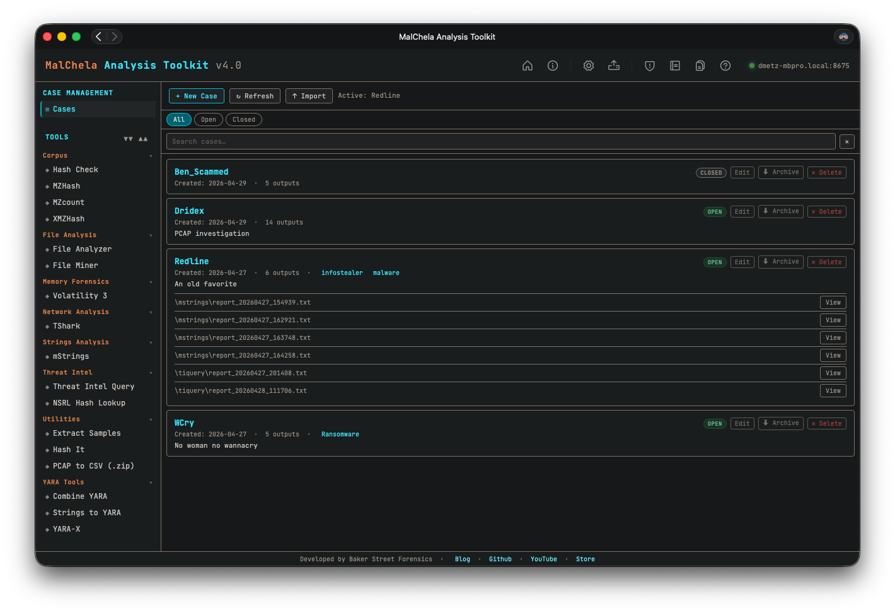
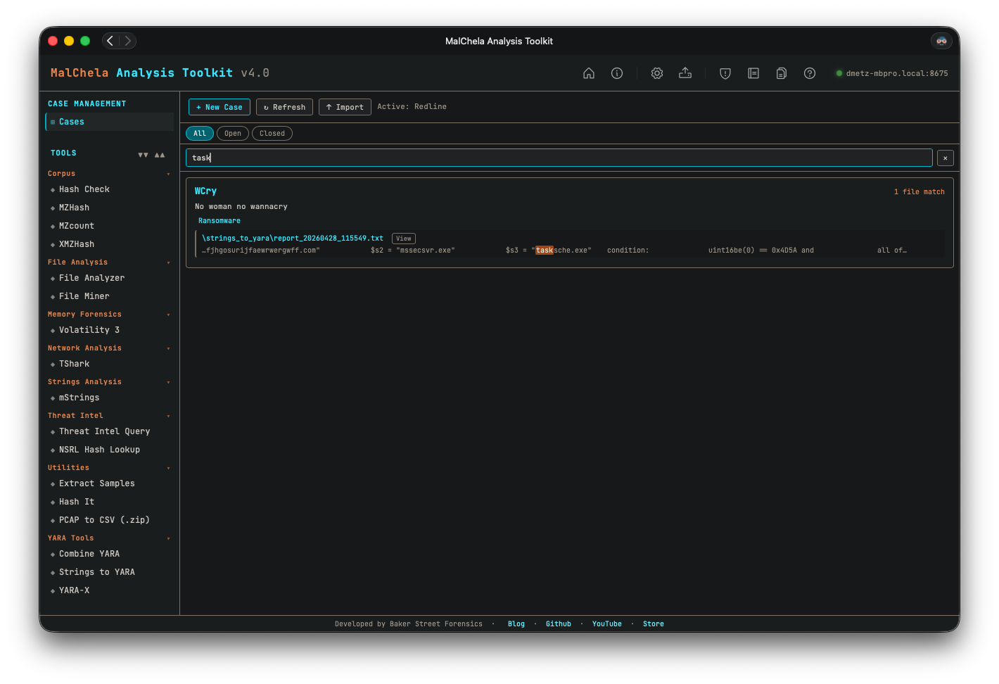

# 4.16 Case Management

The Cases feature in MalChela v4.0 introduces a structured way to manage analysis sessions, organize tool results, and preserve analyst notes for long-term reference. Each case acts as a container for a specific file or folder input, and captures relevant metadata, tool output, and custom annotations.

Cases are managed entirely through the web interface.



<p align="center"><strong> Case Management</p>

## Creating a Case

A case can be created from the New Case menu, or by selecting 'Save to Case' in any tool.


<p align="center"><strong> New Case</p>

After choosing the input, assign a descriptive case name. The web interface will automatically create a new folder under:

```
saved_output/cases/<case_name>/
```

When a **folder** is used as the case input, FileMiner runs automatically and populates an interactive results table. Suggested tools can be launched on a per-file basis directly from the FileMiner results panel.

## Case Contents

Each case folder includes:

- `case.yaml` — combines metadata, case tracking, and user notes in a single structured file
- `fileminer/`, `mstrings/`, `tiquery/`, etc. — tool-specific output directories


## Notes & Tagging

The Notebook allows users to record notes, label items with tags, and track investigative context across sessions.

- Notes can include plain text, YAML fragments, or markdown.

### Tagging

- Tags appear in the Workspace panel under the current case.
- Tags help organize and filter case context.

### Search

From the Case modal, you can search across:

- All saved tool outputs
- Notes contents




<p align="center"><strong> Searching Cases</p>

## Archiving Cases

Cases can be archived into a `.zip` file using the web interface's **Archive Case** feature. This creates a portable snapshot that includes all metadata, notes, and tool outputs.

Archives are saved to:

```
saved_output/case_archives/
```

## Importing Cases

To restore a previously archived case:

1. Open the web interface
2. Use **Import Case**
3. Select a `.zip` archive from `saved_output/case_archives/` (or provide the full path to any valid case archive)

The case will be extracted into `saved_output/cases/` and appear in the workspace. If a case with the same name already exists, you will be prompted to confirm overwrite.


## Summary

Cases enable consistent, organized forensic workflows across sessions and machines. Whether you're triaging suspicious files, running multi-tool pipelines, or preserving findings for reporting, the Cases feature ensures nothing is lost.
