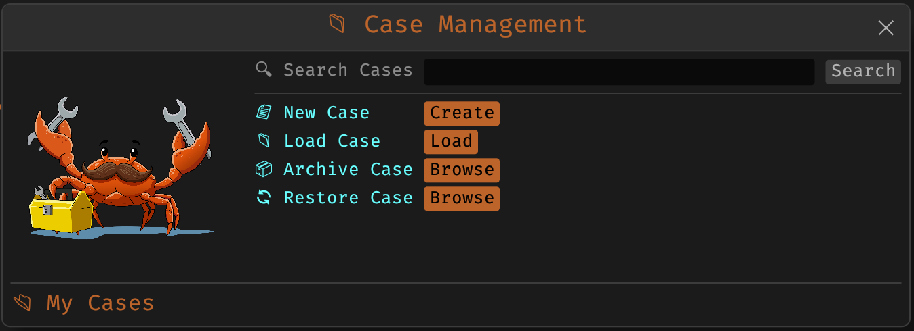
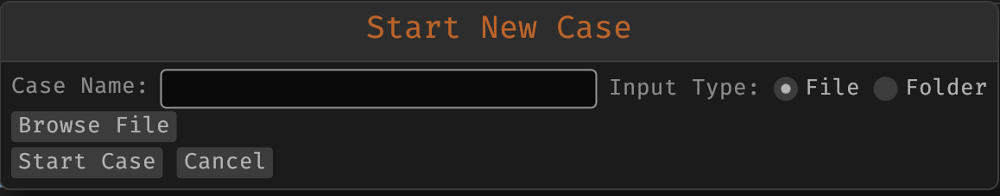
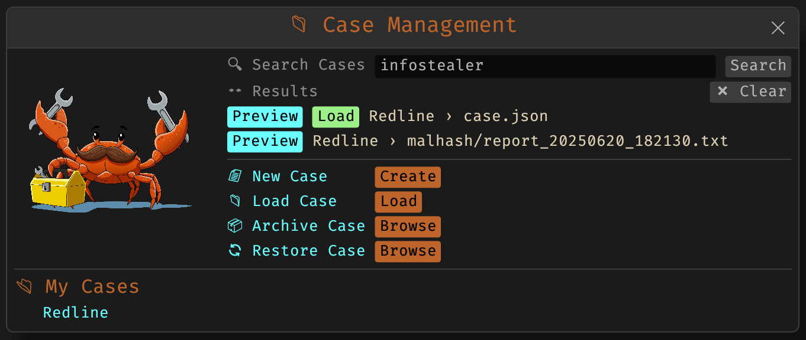

# 4.16 Case Management

The Cases feature in MalChela v3.0 introduces a structured way to manage analysis sessions, organize tool results, and preserve analyst notes for long-term reference. Each case acts as a container for a specific file or folder input, and captures relevant metadata, tool output, and custom annotations.



<p align="center"><strong>Figure 5:</strong> Case Management</p>

## Creating a Case

A case can be created by providing:

- A file (e.g. suspicious binary)
- A folder (directory of unknown files e.g. Tshark export http objects)



<p align="center"><strong>Figure 6:</strong> New Case</p>


After choosing the input, assign a descriptive case name. The GUI will automatically create a new folder under:

```
saved_output/cases/<case_name>/
```

## Case Contents

Each case folder includes:

- `case.yaml`: combines metadata, case tracking, and user notes in a single structured file
- `fileminer/`, `mstrings/`, `malhash/`, etc.: tool-specific output directories
- `tracking/`: flags for completed tool runs

## Notes & Tagging

The scratchpad allows users to record notes, label items with tags, and track investigative context across sessions.

- Notes can include plain text, YAML fragments, or markdown.


### Tagging:

- Any word prefixed with `#` (e.g., `#malware`, `#tshark`) becomes a tag.
- These tags will appear in the Workspace panel under the current case.
- Tags help organize and filter case context.

### Search:

- From the Case Modal, you can search across:
  - All saved tool outputs
  - Notes contents
  - Tags (by prefixing with `#`)



<p align="center"><strong>Figure 7:</strong> Searching Cases</p>

## Archiving & Restoring Cases

Cases can be archived into a `.zip` file using the GUI's **Archive Case** feature. This creates a portable snapshot that includes all metadata, notes, and tool outputs.

To restore a case:

- Open the GUI
- Use **Restore Case**
- Select a `.zip` archive containing a valid `case.json`

The case will be rehydrated into the `saved_output/cases/` directory and appear in the workspace.

## Case-Aware Tool Tracking

Tools launched from the workspace automatically write output into the active case's subfolder and register a tracking file to avoid redundant execution.


<p align="center"><strong>Figure 8:</strong> Example Case</p>

## Summary

Cases enable consistent, organized forensic workflows across sessions and machines. Whether you're triaging suspicious files, running multi-tool pipelines, or collaborating across systems, the Cases feature ensures nothing is lost.