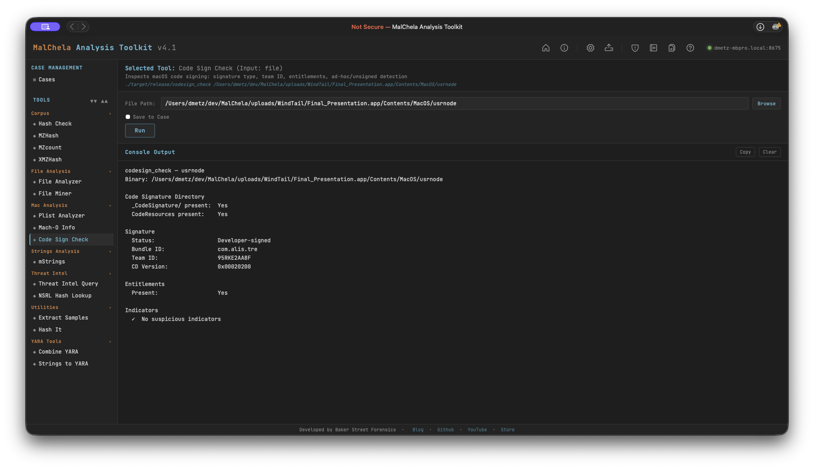

Code Sign Check inspects macOS code signing by parsing the code signature superblob directly from the Mach-O binary — no dependency on system `codesign` tooling. It identifies whether a binary is Developer-signed, ad-hoc signed, or completely unsigned, and extracts the Team ID, Bundle ID, entitlements, and CodeDirectory version.

Accepts either a `.app` bundle path (resolves the binary via `Info.plist`) or a direct path to a Mach-O binary. Handles fat/universal binaries.



<p align="center"><strong>Code Sign Check</p>

---

### What It Checks

**Code Signature Directory**
- Presence of `_CodeSignature/` directory within the bundle
- Presence of `CodeResources` (bundle resource seal)

**Signature Status**
- **Developer-signed** — CMS blob present, certificate chain embedded
- **Ad-hoc** — `CS_ADHOC` flag set in CodeDirectory and/or no CMS blob; self-signed, not from a developer account
- **Unsigned** — no `_CodeSignature/` directory and no valid superblob

**Extracted Fields**
- Bundle ID (from CodeDirectory `identOffset`)
- Team ID (from CodeDirectory `teamIDOffset`, version ≥ 0x20200)
- CodeDirectory version and flags
- Entitlements presence
- `get-task-allow` entitlement (marks a debug/development build — not App Store or notarized)

---

### Indicators Flagged

| Indicator | Significance |
|-----------|-------------|
| No `_CodeSignature/` | Binary is unsigned |
| No CMS blob | Ad-hoc signature — not issued by a developer account |
| `CS_ADHOC` flag set | Ad-hoc signing confirmed in CodeDirectory flags |
| No Team ID | Ad-hoc, self-signed, or very old signing format |
| `get-task-allow` | Debug build — allows task port access; not notarized |

> **Note:** Code Sign Check reports what is embedded in the binary. It does not perform an online revocation check (OCSP/CRL). A Developer-signed result means a real certificate was used at signing time — it does not confirm the certificate is still valid or unrevoked.

---

### PWA Usage

Select **Code Sign Check** from the Mac Analysis category. Enter the path to a `.app` bundle or a Mach-O binary. File Miner will suggest Code Sign Check for any file it identifies as `x-mach-binary`.

---

### 🔧 CLI Syntax

```bash
# Check a .app bundle
cargo run -p codesign_check -- /path/to/Sample.app

# Check a Mach-O binary directly
cargo run -p codesign_check -- /path/to/binary

# Save output as Markdown to a case folder
cargo run -p codesign_check -- /path/to/Sample.app -o -m --case CaseXYZ
```

Use `-o` to save output and include one of the following format flags:
- `-t` → Save as `.txt`
- `-m` → Save as `.md`

When `--case` is used, output is saved to:

```
saved_output/cases/CaseXYZ/codesign_check/
```

Otherwise, results are saved to:

```
saved_output/codesign_check/
```
