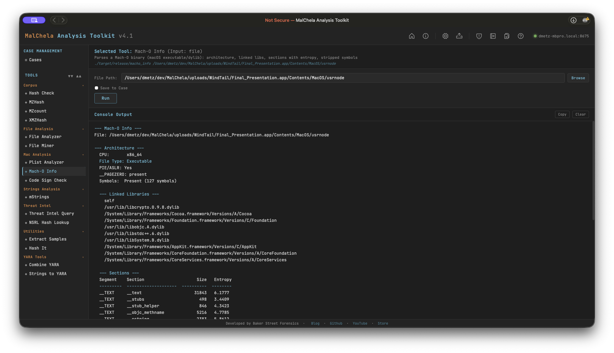

Mach-O Info performs static analysis on macOS Mach-O binaries, including both thin (single-architecture) and fat/universal binaries. It reports architecture details, linked libraries, RPATH entries, per-section entropy, and symbol table status. Suspicious indicators are flagged automatically in the Indicators section.



<p align="center"><strong>Mach-O Info</p>

---

### Analysis Sections

**Architecture**
- CPU type and subtype (x86_64, arm64, arm64e)
- File type (Executable, Dynamic library, Bundle, etc.)
- PIE/ASLR status (`MH_PIE` flag)
- `__PAGEZERO` presence and size (zero-sized = privilege escalation risk)
- Symbol table: present count or stripped

**Linked Libraries**
All dylibs declared in load commands, including system frameworks and third-party libraries.

**RPATH Entries**
Relative paths searched for dylib resolution — a vector for dylib hijacking if writable.

**Sections with Entropy**
Per-section entropy table. Sections above 7.0 are flagged as potentially packed or encrypted.

---

### Indicators Flagged

| Indicator | Significance |
|-----------|-------------|
| Stripped symbol table | Adversarial hardening — hinders analysis |
| Zero-sized `__PAGEZERO` | Classic privilege escalation technique in older macOS malware |
| High-entropy section (> 7.0) | Possible packed or encrypted payload |
| RPATH entries | Potential dylib hijacking surface |
| Deprecated crypto library | `libcrypto.0.9.8` / `libssl.0.9.8` — EOL OpenSSL with numerous known CVEs |
| C2 dylib triad | CoreFoundation + SystemConfiguration + Security with minimal other imports — common implant pattern |

---

### PWA Usage

Select **Mach-O Info** from the Mac Analysis category and provide the path to a Mach-O binary. File Miner will suggest Mach-O Info for any file it identifies as `x-mach-binary`.

---

### 🔧 CLI Syntax

```bash
# Analyze a Mach-O binary
cargo run -p macho_info -- /path/to/binary

# Save output as Markdown to a case folder
cargo run -p macho_info -- /path/to/binary -o -m --case CaseXYZ
```

Use `-o` to save output and include one of the following format flags:
- `-t` → Save as `.txt`
- `-j` → Save as `.json`
- `-m` → Save as `.md`

When `--case` is used, output is saved to:

```
saved_output/cases/CaseXYZ/macho_info/
```

Otherwise, results are saved to:

```
saved_output/macho_info/
```
