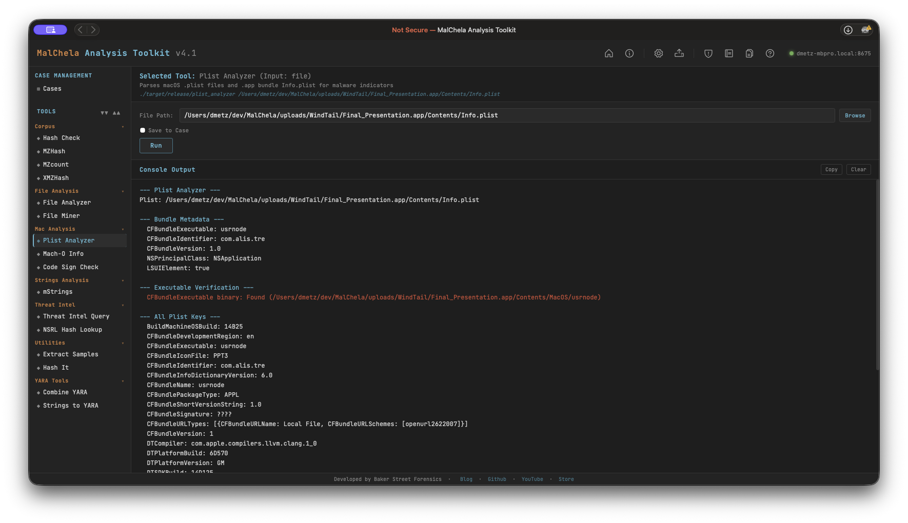

Plist Analyzer parses macOS `.plist` files and `.app` bundle `Info.plist` for static malware indicators. It extracts bundle metadata, verifies the declared executable is present, and flags suspicious key combinations commonly found in macOS malware — including background-only agents, disabled App Transport Security, custom URL scheme registration, and environment variable injection.



<p align="center"><strong>Plist Analyzer</p>

---

### Indicators Checked

| Indicator | Key | Why It Matters |
|-----------|-----|----------------|
| Hidden background agent | `LSUIElement` / `NSUIElement` = true | App runs with no Dock icon — common stealth technique |
| ATS disabled | `NSAllowsArbitraryLoads` = true | Allows unencrypted HTTP connections — classic C2 channel |
| Custom URL scheme | `CFBundleURLTypes` | Non-standard URL handler registration — used for persistence or IPC |
| No creator code | `CFBundleSignature` = `????` | Missing creator code — common in unsigned tools and malware |
| Env var injection | `LSEnvironment` present | Malware may inject environment variables at launch |
| Missing executable | `CFBundleExecutable` not in `Contents/MacOS/` | Bundle metadata declares a binary that doesn't exist |
| Extra binaries | Additional files in `Contents/MacOS/` | Undeclared executables alongside the declared one |

---

### PWA Usage

Select **Plist Analyzer** from the Mac Analysis category. Enter the path to:
- A `.plist` file directly, or
- A `.app` bundle directory — the tool will automatically locate `Contents/Info.plist`

File Miner will suggest Plist Analyzer for `.plist` files it encounters during a folder scan.

---

### 🔧 CLI Syntax

```bash
# Analyze a .plist file
cargo run -p plist_analyzer -- /path/to/Info.plist

# Analyze a .app bundle (Info.plist resolved automatically)
cargo run -p plist_analyzer -- /path/to/Sample.app

# Save output as Markdown to a case folder
cargo run -p plist_analyzer -- /path/to/Info.plist -o -m --case CaseXYZ
```

Use `-o` to save output and include one of the following format flags:
- `-t` → Save as `.txt`
- `-j` → Save as `.json`
- `-m` → Save as `.md`

When `--case` is used, output is saved to:

```
saved_output/cases/CaseXYZ/plist_analyzer/
```

Otherwise, results are saved to:

```
saved_output/plist_analyzer/
```
