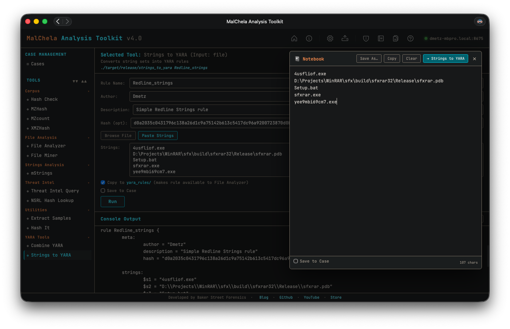

Strings to YARA helps you rapidly build custom YARA rules by prompting for a rule name, optional metadata, and a list of string indicators. It integrates with the MalChela scratchpad, allowing you to paste or collect candidate strings interactively.

Lines beginning with hash: are deliberately ignored during rule generation — this lets you use the scratchpad to track hashes alongside strings without polluting your YARA rule content.

Any **defanged** line (`hxxp://`, `hxxps://`, `fxxp://`, or `[.]` in place of a literal dot — the same defanging [mStrings](mstrings.md) and the Analyze rollup use when displaying network IOCs) is automatically refanged back to the real string before it's written into the rule. YARA matches raw bytes in the target file, which contain the real string, never the defanged display form — so a URL copied straight out of a report generates a rule that actually matches something, without you having to manually fix it up first. Lines that were never defanged pass through unchanged.



<p align="center"><strong> Strings to YARA</p>

---

### 🔧 CLI Syntax

```bash
cargo run -p strings_to_yara -- RuleName Author Description Hash /path/to/strings.txt --case CaseName
```

You can supply up to five positional arguments. If any are omitted, the tool will prompt you interactively.

```bash
Enter rule name:
Enter author:
Enter description:
Enter hash (optional):
Enter path to string list file:
```

If the `--case` flag is supplied, the resulting YARA rule will be saved in the corresponding `saved_output/cases/CaseName/` directory.

Lines in the string file that begin with `hash:` are ignored and will not be included in the generated rule.
