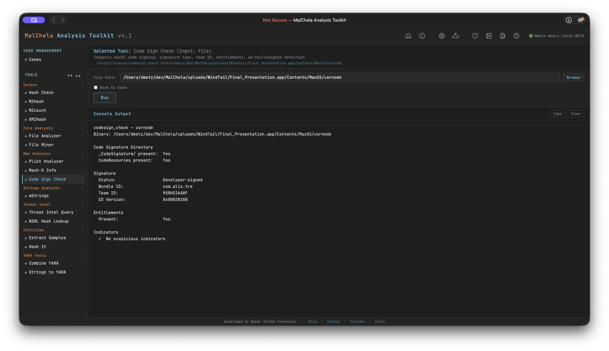

Code Sign Check inspects macOS code signing by parsing the code signature superblob directly from the Mach-O binary — no dependency on system `codesign` tooling. It identifies whether a binary is Developer-signed, ad-hoc signed, or completely unsigned, and extracts the Team ID, Bundle ID, entitlements, and CodeDirectory version.

Accepts either a `.app` bundle path (resolves the binary via `Info.plist`) or a direct path to a Mach-O binary. Handles fat/universal binaries.



<p align="center"><strong>Code Sign Check</p>

---

### What It Checks

**Code Signature Directory**
- Presence of `_CodeSignature/` directory within the bundle
- Presence of `CodeResources` (bundle resource seal)

**Signature Status**
- **Developer-signed** — CMS blob present, certificate chain embedded
- **Ad-hoc** — `CS_ADHOC` flag set in CodeDirectory and/or no CMS blob; self-signed, not from a developer account
- **Unsigned** — no `_CodeSignature/` directory and no valid superblob

**Extracted Fields**
- Bundle ID (from CodeDirectory `identOffset`)
- Team ID (from CodeDirectory `teamIDOffset`, version ≥ 0x20200)
- CodeDirectory version and flags
- Entitlements presence
- `get-task-allow` entitlement (marks a debug/development build — not App Store or notarized)

---

### Indicators Flagged

| Indicator | Significance |
|-----------|-------------|
| No `_CodeSignature/` | Binary is unsigned |
| No CMS blob | Ad-hoc signature — not issued by a developer account |
| `CS_ADHOC` flag set | Ad-hoc signing confirmed in CodeDirectory flags |
| No Team ID | Ad-hoc, self-signed, or very old signing format |
| `get-task-allow` | Debug build — allows task port access; not notarized |

> **Note:** By default, Code Sign Check reports what is embedded in the binary and nothing more — a Developer-signed result means a real certificate was used at signing time, not that it's still valid. Pass `--check-revocation` (see below) for a live OCSP check against Apple's revocation infrastructure.

---

### Revocation (OCSP) Check

`--check-revocation` queries Apple's OCSP responder to check whether the Developer ID certificate that signed the binary has since been revoked — a strong, independent signal for malware triage: Apple actively revokes certificates tied to known-malicious signers once discovered, so a `REVOKED` result on an otherwise unremarkable binary is itself a finding.

This is opt-in and off by default because it requires live network access — it does **not** run as part of a plain Code Sign Check invocation.

**How it works:** the certificate chain is extracted from the Mach-O's embedded CMS blob and handed to the system `openssl` client (`pkcs7`/`x509`/`ocsp`), which performs the actual query. Apple's codesign tool emits that CMS blob as BER with indefinite-length encoding — valid BER, not valid DER — so this deliberately uses openssl's BER-tolerant ASN.1 parser rather than a strict-DER library, which would reject the blob outright. Leaf vs. issuer certificate is identified generically (the leaf is whichever certificate in the embedded chain wasn't used to issue any other certificate in the set), so it isn't tied to a fixed chain length.

**Possible statuses:**

| Status | Meaning |
|--------|---------|
| `GOOD` | Certificate is valid and not revoked, as of the query |
| `REVOKED` | Apple has revoked this certificate — shown with the reason and revocation date from the OCSP response |
| `UNKNOWN` | The responder has no record of this certificate |
| `Not checked` | Query wasn't attempted or couldn't complete — reason given (offline mode, ad-hoc/unsigned binary, no OCSP URL in the certificate — common for pre-~2016 Developer ID certs, network/openssl failure, etc.) |

A `REVOKED` result also surfaces as a warning in the **Indicators** section and in saved reports.

**Offline Mode:** this check honors [Offline Mode](../configuration/offline-mode.md) directly (`MALCHELA_OFFLINE`) — it self-skips with a clean "Not checked (offline mode)" result rather than attempting the network call, the same convention every other network-touching MalChela tool follows. This is checked inside `codesign_check` itself, not just by callers like Analyze, so it's honored no matter how `--check-revocation` gets invoked.

**In Analyze:** [Analyze](../coretools/analyze.md) automatically passes `--check-revocation` for every Code Sign Check run it dispatches, scoped to the **top-level binary only** — not embedded frameworks/plugins/XPC helpers, since a single bundle can carry dozens of those (Audacity.app alone embeds 90+ signed dylibs), each of which would otherwise trigger its own OCSP query. It's skipped automatically whenever Offline Mode is on.

Not currently exposed as a toggle in the standalone PWA Code Sign Check panel or the MCP `codesign_check` tool — use the CLI flag directly, or run it through Analyze, for now.

---

### PWA Usage

Select **Code Sign Check** from the Mac Analysis category. Enter the path to a `.app` bundle or a Mach-O binary. File Miner will suggest Code Sign Check for any file it identifies as `x-mach-binary`.

---

### 🔧 CLI Syntax

```bash
# Check a .app bundle
cargo run -p codesign_check -- /path/to/Sample.app

# Check a Mach-O binary directly
cargo run -p codesign_check -- /path/to/binary

# Also check OCSP revocation status (requires network access and openssl on PATH)
cargo run -p codesign_check -- /path/to/binary --check-revocation

# Save output as Markdown to a case folder
cargo run -p codesign_check -- /path/to/Sample.app -o -m --case CaseXYZ
```

Use `-o` to save output and include one of the following format flags:
- `-t` → Save as `.txt`
- `-m` → Save as `.md`

When `--case` is used, output is saved to:

```
saved_output/cases/CaseXYZ/codesign_check/
```

Otherwise, results are saved to:

```
saved_output/codesign_check/
```
