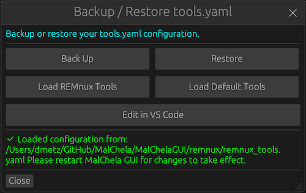

# REMnux Mode

MalChela includes built-in support for running in **REMnux Mode**, a configuration designed specifically for seamless operation within the REMnux malware analysis distribution.

---

## How REMnux Mode Works

REMnux Mode is a configuration profile that aligns MalChela’s behavior with the REMnux malware analysis distribution. It adjusts paths, tool definitions, and GUI presentation to match the REMnux environment.

This mode is manually enabled by selecting **“Load REMnux”** from the tools.yaml Configuration Panel in the GUI. Once selected, a REMnux-specific `tools.yaml` file is loaded and remains active until you replace it with another configuration.

<strong>Figure 7.1:</strong> Enabling REMnux mode

> Note: Whenever you change the tools.yaml, you need to restart the GUI for it to take effect.

---

<strong>Figure 7.2:</strong> MalChela in REMnux Mode 

---

## Preconfigured Tools in REMnux Mode

The following tools will appear in the GUI when REMnux Mode is enabled. Each is preconfigured with known-good paths for the REMnux environment:

### File Analysis

| Tool     | Description                                        | Command     |
|----------|----------------------------------------------------|-------------|
| binwalk  | Scan binary files for embedded files               | `binwalk`   |
| capa     | Detects capabilities in binaries via rules         | `capa`      |
| FLOSS    | Extract obfuscated strings from binaries           | `floss`     |
| radare2  | Scan binary files                                  | `/usr/bin/r2 -i` |

---

### Memory Forensics

| Tool         | Description                          | Command |
|--------------|--------------------------------------|---------|
| Volatility 3 | Memory analysis using Volatility 3   | `vol3`  |

---

### Metadata Analysis

| Tool     | Description                        | Command    |
|----------|------------------------------------|------------|
| exiftool | Extract metadata from files        | `exiftool` |

---

### Network Forensics

| Tool    | Description               | Command   |
|---------|---------------------------|-----------|
| TShark  | Analyze network traffic   | `tshark`  |

---

### Office Document Analysis

| Tool       | Description                                         | Command                         |
|------------|-----------------------------------------------------|----------------------------------|
| mraptor    | Detect auto-executing macros in Office docs         | `mraptor`                        |
| oledump    | Dump streams from OLE files                         | `oledump.py`                     |
| oleid      | Analyze OLE files for suspicious indicators         | `oleid`                          |
| olevba     | Extract VBA macros from OLE files                   | `olevba`                         |
| rtfobj     | Extract embedded objects from RTF files             | `rtfobj`                         |
| zipdump    | Parses and analyzes suspicious PDF structures       | `zipdump.py`                     |

---

### PDF Analysis

| Tool        | Description                                 | Command                             |
|-------------|---------------------------------------------|-------------------------------------|
| pdf-parser  | Parse structure and objects of a PDF file   | `python3 /usr/local/bin/pdf-parser.py` |

---

### Utilities

| Tool      | Description                               | Command     |
|-----------|-------------------------------------------|-------------|
| clamscan  | Antivirus scan using ClamAV               | `clamscan`  |
| strings   | Extracts printable strings from binary files | `strings` |

---

## Benefits

- Tools like **Volatility 3**, **FLOSS**, **oledump**, and **olevba** are preconfigured and ready to go
- `tools.yaml` is auto-tailored to the REMnux environment
- You can still customize your tool entries, but defaults are optimized for REMnux paths and permissions
- Useful for education, triage labs, and portable analysis setups

---

## Customizing the REMnux Experience

Although REMnux Mode provides sane defaults, you can still:

- Override tool entries in `tools.yaml`
- Add new third-party tools via the GUI or YAML
- Use the Configuration Panel to backup/restore your configuration

---

For more information about REMnux, visit [REMnux.org](https://remnux.org).
