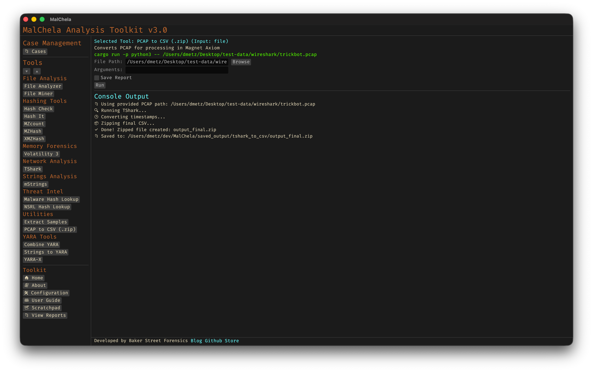

# PCAP to CSV Conversion

The `tshark_to_csv.py` script is a helper utility that converts `.pcap` or `.pcapng` files into structured `.csv` files using `tshark`. This allows packet captures to be processed and analyzed using familiar spreadsheet or database tools.

<strong>Figure 28:</strong> PCAP to CSV

The script uses `tshark` to extract key fields from each packet and writes them to a CSV file with headers. Users can specify custom fields, or rely on a default set commonly useful for forensic review.

Timestamps in the CSV output are converted into a human-readable ISO 8601 format with microsecond precision (`YYYY-MM-DDTHH:MM:SS.ssssssZ`), ensuring compatibility with downstream tools such as the Magnet Custom Artifact Generator.

This script is included in the MalChela repository under `Utilities/`, and is referenced in `tools.yaml` but commented out by default. Uncomment the entry in `tools.yaml` to enable it in the GUI.

Requirements:

- Python 3
- Wireshark/tshark (must be installed and available in PATH)
