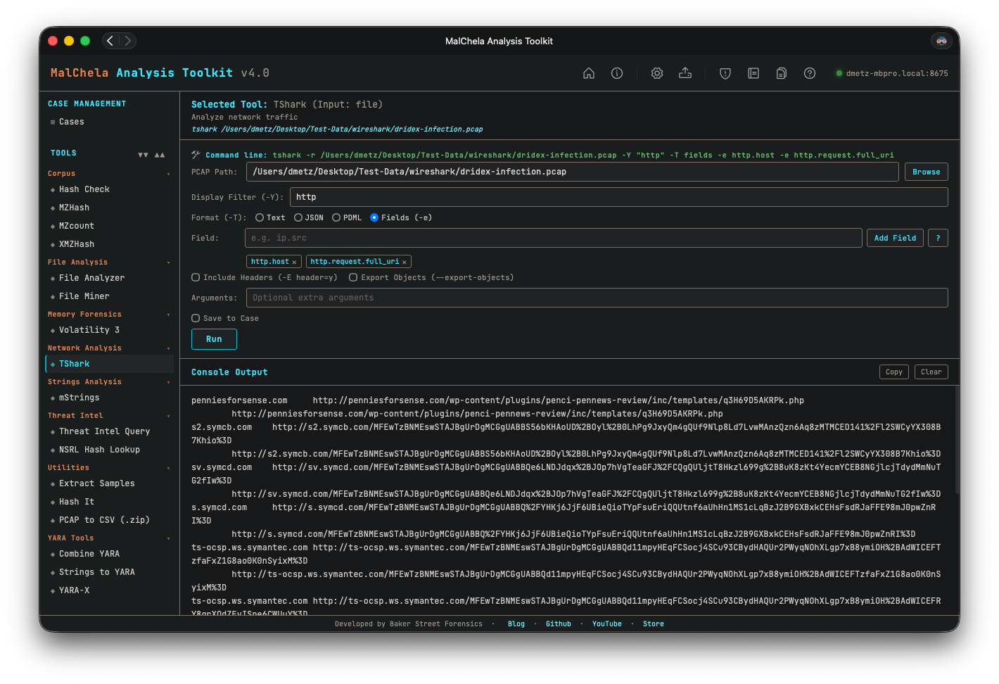

### TShark Field Reference Panel

If TShark is included in your `tools.yaml` (or if you’re using the REMnux configuration), the GUI offers a powerful set of tools to assist with display filter creation and usage. This includes both an integrated filter builder and a TShark Field Reference panel.

- The filter builder allows users to construct and modify complex TShark display filters directly within the GUI, with real-time syntax support and validation.
- The “?” icon next to filter fields launches the Field Reference panel, which provides searchable field definitions, examples, tooltips, and a copy-to-clipboard feature.
- Together, these tools help analysts visually explore and test filter syntax without needing to memorize protocol-specific field names.
- Output can be saved to the default location or to a specific case directory.

<strong>Figure 5.2:</strong> TShark
