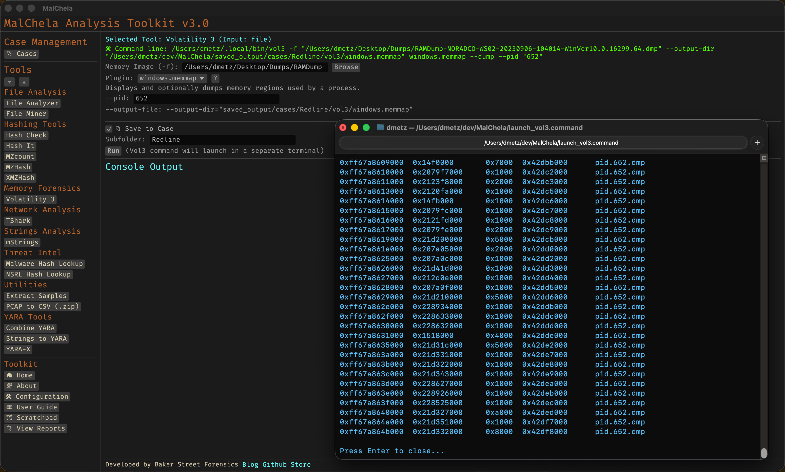
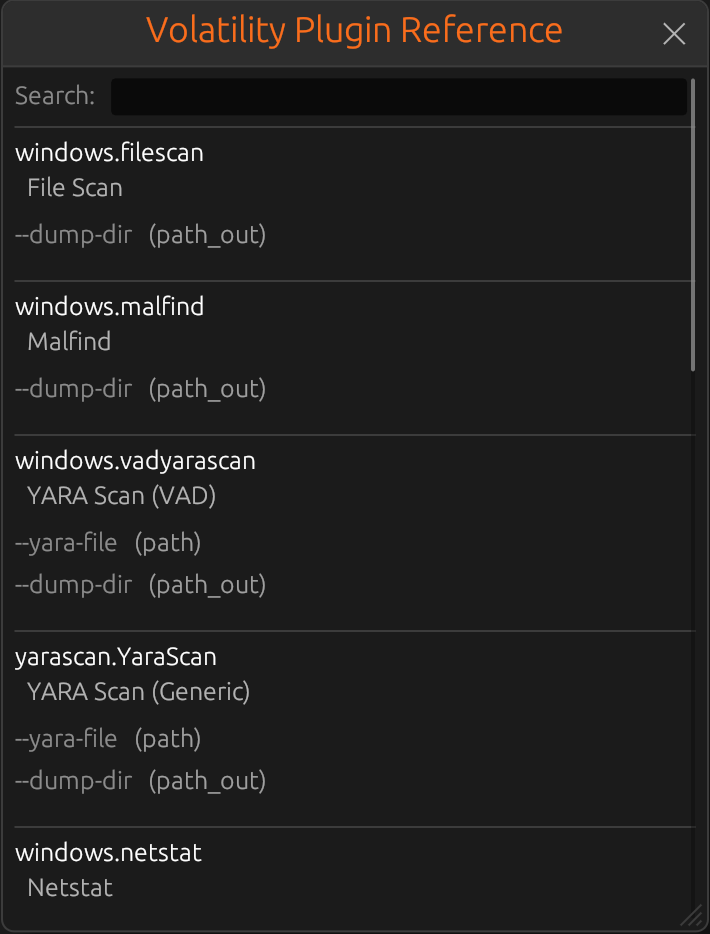

# Volatility 3

MalChela integrates support for **Volatility 3**, a powerful memory forensics framework. This tool enables analysts to examine memory dumps for signs of compromise, persistence mechanisms, and malicious activity.

---

## Integration Overview

Volatility 3 is available in MalChela as an enhanced third-party tool. The GUI provides a dedicated interface for selecting plugins, supplying arguments, and reviewing results — all within a structured panel that mimics the CLI workflow but adds quality-of-life improvements like:

- Live search and categorized plugin reference
- Plugin-specific argument helpers
- Color-coded output for easier review
- Output saving and file dump options
- Output can be saved to the default location or to a specific case directory.




<p align="center"><strong>Figure 6.4:</strong> Volatility (launches in separate terminal)</p>



<p align="left"><strong>Figure 6.5:</strong> Volatility Plugin Reference</p>

---

## Requirements

To use Volatility 3 within MalChela:

- You must have `vol3` (Volatility 3 CLI) installed and accessible in your system `$PATH`.
- On REMnux, `vol3` is preinstalled and configured automatically.
- On macOS or Linux, you can install it via pip:
  ```
  pip install volatility3
  ```

---


## tools.yaml Configuration

To use Volatility 3 with the GUI launcher, ensure the correct `command` value is defined in your `tools.yaml` configuration. Depending on your environment, the binary may be installed under different names or locations.

Two common examples:

```yaml
- name: Volatility 3
  description: "Memory analysis using Volatility 3"
  command: ["/Users/dmetz/.local/bin/vol3"]
  input_type: "file"
  file_position: "first"
  category: "Memory Forensics"
  gui_mode_args: []
  exec_type: binary

- name: Volatility 3
  description: "Memory analysis using Volatility 3"
  command: ["vol3"]
  input_type: "file"
  file_position: "first"
  category: "Memory Forensics"
  gui_mode_args: []
  exec_type: script
```

Make sure that the specified binary path or command is accessible in your system’s `$PATH`.

---

## Example Use Cases

- Enumerate processes: `windows.pslist`
- Dump suspicious files from memory: `windows.dumpfiles --dump-dir /output/path`
- Detect injected code: `windows.malfind`
- YARA scanning on memory: `windows.vadyarascan --yara-file rules.yar`

---

## Output and Reports

All plugin results are streamed to the GUI console with formatting preserved. Where supported, plugins that produce dumped files will output to a user-specified folder.

---

## Known Limitations

- Some plugins require symbol files (`.pdb`) to function correctly. Volatility will display a warning if missing.
- Ensure sufficient system memory when analyzing large memory dumps.

---

## Additional Resources

- [Volatility 3 GitHub](https://github.com/volatilityfoundation/volatility3)
- [Official Documentation](https://volatility3.readthedocs.io)