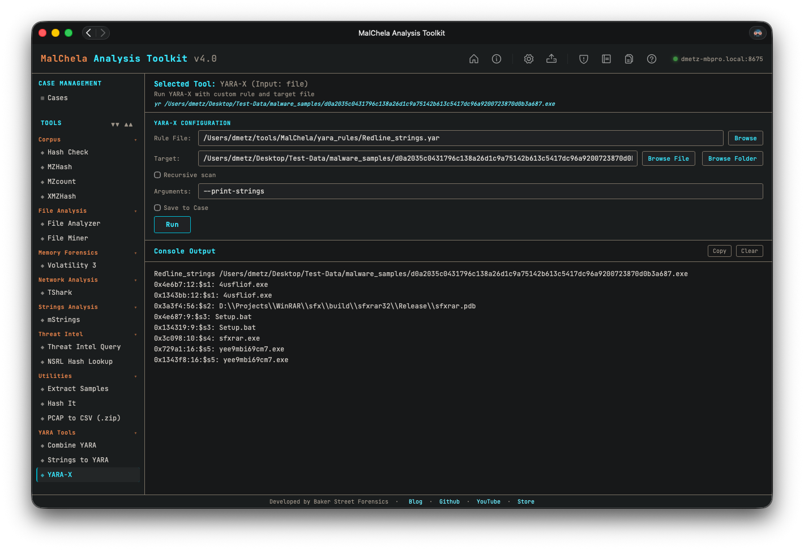

# Installing and Configuring YARA-X



<p align="center"><strong>Figure 6.6:</strong> YARA-X </p>

---

YARA-X is an extended version of YARA with enhanced performance and features. To integrate YARA-X with MalChela, follow these steps:

## Installation

- **Download the latest release:**  
   Visit the official YARA-X GitHub releases page at [https://github.com/VirusTotal/yara-x/releases](https://github.com/VirusTotal/yara-x/releases) and download the appropriate binary for your platform.

- **Extract and install:**  
   Extract the downloaded archive and place the `yara-x` binary (`yr`) in a directory included in your system’s `$PATH`, or note its absolute path for configuration.

- **Verify installation:**  
   Run the following command to confirm YARA-X is installed correctly:

```bash
yr —version
```

## Configuration in MalChela

To use YARA-X within MalChela tools, update your `tools.yaml` with the following example entry:

```yaml
- name: yara-x
  description: “High-performance YARA-X engine”
  command: [“yara-x”]
  input_type: “file”
  file_position: “last”
  category: “File Analysis”
  optional_args: []
  exec_type: binary
```

## Using YARA-X Rules

- Place your YARA rules in the `yara_rules` folder within the workspace.
- YARA-X supports recursive includes and extended features; ensure your rules are compatible.
- The MalChela GUI and CLI will invoke YARA-X when configured as above, providing faster scans and improved detection.

## Tips

- For advanced usage, consult the [YARA-X documentation](https://github.com/Yara-Rules/yara-x) for command-line options and rule syntax.
